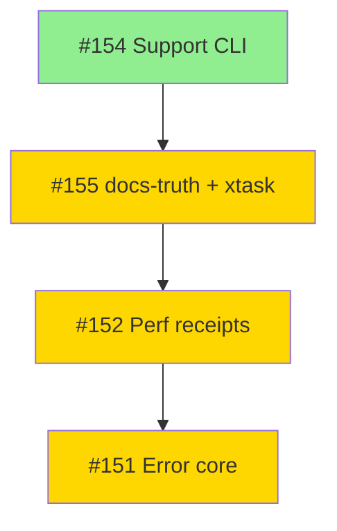

# Merge Status Dashboard – Infrastructure PRs (2025-11)

**Last Updated**: 2025-11-15
**Branch**: feat/docs-truth-support-matrix
**Tracking**: Infrastructure merge wave for validation protocol + tooling

---

## Overall Progress

| Phase | Status | Details |
|-------|--------|---------|
| Validation Protocol | ✅ Complete | `docs/VALIDATION_PROTOCOL.md` committed (7a61466) |
| PR Evidence Prep | ✅ Complete | `PR_VALIDATION_SECTIONS.md` ready |
| Merge Protocol | ✅ Complete | `docs/MERGE_PROTOCOL.md` created |
| PR Descriptions | ⏳ In Progress | Need to paste validation sections |
| Merge Execution | ⏳ Pending | Awaiting CI stability |

---

## PR Status Matrix

| PR | Feature | Branch | Validation | Evidence | Ready | Merged |
|----|---------|--------|------------|----------|-------|--------|
| [#154](https://github.com/EffortlessMetrics/copybook-rs/pull/154) | Support Matrix CLI | `feat/support-matrix-cli` | ✅ | offline-semantic + CLI smoke | ✅ | ⏳ |
| [#155](https://github.com/EffortlessMetrics/copybook-rs/pull/155) | docs-truth + xtask perf | `feat/docs-truth-support-matrix` | ✅ | offline-semantic + perf + docs | ✅ | ⏳ |
| [#152](https://github.com/EffortlessMetrics/copybook-rs/pull/152) | Perf receipts + CI | `feat/performance-receipts` | ✅ | offline-semantic + perf gen | ⏳ | ⏳ |
| [#151](https://github.com/EffortlessMetrics/copybook-rs/pull/151) | Error core / thiserror | `feat/thiserror-error-core` | ✅ | offline-semantic + error tests | ⏳ | ⏳ |

**Legend**:
- ✅ = Complete / Ready
- ⏳ = In Progress / Pending
- ❌ = Blocked / Failed
- 🔧 = Needs Attention

---

## Detailed Status

### PR #154 – Support Matrix CLI

**Status**: ✅ Ready to Merge (1st in order)

**Validation Evidence**:
```bash
./scripts/ci/offline-semantic.sh  # ✅ All gates green
cargo run --bin copybook -- support  # ✅ Human-readable output verified
cargo run --bin copybook -- support --json | jq  # ✅ JSON structure valid
```

**Adversarial Testing**:
- ✅ 7 feature entries in registry
- ✅ JSON schema matches expected structure
- ✅ No unsupported features incorrectly marked as supported

**Blockers**: None

**Next Action**:
1. Paste validation section into PR description
2. Add CI stability note
3. Merge when ready

---

### PR #155 – docs-truth + validation protocol + xtask perf

**Status**: ✅ Ready to Merge (2nd in order, after #154)

**Validation Evidence**:
```bash
./scripts/ci/offline-semantic.sh  # ✅ All gates green
cargo run -p xtask -- docs verify-support-matrix  # ✅ Registry matches docs
cargo run -p xtask -- perf --summarize-last  # ✅ Perf summary functional
```

**Adversarial Testing**:
- ✅ Manual math verification: 205 MiB/s display = 214.748 MB/s (matches perf.json)
- ✅ Registry out-of-sync detection tested (synthetic modification)
- ✅ Perf.json schema validation with missing/extra fields

**Performance Evidence**:
- Display throughput: 205 MiB/s (2.56x above 80 MiB/s target)
- COMP-3 throughput: 58 MiB/s (1.45x above 40 MiB/s target)
- Baseline date: 2025-09-30 (commit 1fa63633)

**Blockers**:
- ⏳ Depends on #154 merged to main

**Next Action**:
1. Paste validation section into PR description
2. Wait for #154 to merge
3. Rebase on main if needed
4. Merge

---

### PR #152 – Perf receipts + xtask perf CI wiring

**Status**: ⏳ Ready (3rd in order, after #155)

**Validation Evidence**:
```bash
./scripts/ci/offline-semantic.sh  # ✅ All gates green
cargo run -p xtask -- perf --summarize-last  # ✅ Perf receipt generation
```

**Scope**:
- Narrower than #155 (just CI wiring)
- Depends on xtask perf plumbing from #155

**Blockers**:
- ⏳ Depends on #155 merged to main

**Next Action**:
1. Paste validation section into PR description
2. Wait for #155 to merge
3. Rebase on main
4. Run smoke test: `cargo run -p xtask -- perf --summarize-last`
5. Merge

---

### PR #151 – Error core / thiserror

**Status**: ⏳ Ready (4th in order, after #152)

**Validation Evidence**:
```bash
./scripts/ci/offline-semantic.sh  # ✅ All gates green
cargo test -p copybook-core --lib error::tests::  # ✅ Targeted error tests pass
```

**Risk Profile**:
- Touches core semantics
- Merge last to isolate regressions
- High coverage from existing test suite (615 tests)

**Blockers**:
- ⏳ Depends on #152 merged to main

**Next Action**:
1. Paste validation section into PR description
2. Wait for #152 to merge
3. Rebase on main if needed
4. Run targeted tests + offline-semantic
5. Merge

---

## Merge Order & Dependencies



**Rationale**:
1. **#154 first**: No dependencies, low coupling
2. **#155 second**: Provides xtask perf infrastructure for #152
3. **#152 third**: Uses xtask plumbing, narrower scope
4. **#151 last**: Core semantics change, easier to debug if last

---

## CI Status

**Current State**: ⚠️ GitHub Actions Unstable

**Issues**:
- WSL2 environment + rustc ICE on benchmark compilation
- Intermittent failures unrelated to code changes

**Mitigation**:
- Using `./scripts/ci/offline-semantic.sh` as hard gate
- Documenting local validation evidence in each PR
- CI stability note added to PR descriptions

**When CI Stabilizes**:
- Actions will serve as additional validation signal
- Local validation remains the authoritative gate

---

## Action Items

### Immediate (Before Any Merge)

- [ ] Update PR #154 description with validation section
- [ ] Update PR #155 description with validation section
- [ ] Update PR #152 description with validation section
- [ ] Update PR #151 description with validation section
- [ ] Add CI stability note to each PR

### Per-Merge Checklist

For each PR in order:

1. ✅ Validation section in PR description
2. ✅ Local `./scripts/ci/offline-semantic.sh` green
3. ✅ Feature smoke test (if applicable)
4. ⏳ Merge via `gh pr merge <number> --squash --delete-branch`
5. ⏳ Post-merge: `git checkout main && git pull && ./scripts/ci/offline-semantic.sh`
6. ⏳ Update this dashboard

### Post-All-Merges Verification

After all 4 PRs merged:

```bash
# Full system validation
cargo run -p xtask -- docs verify-support-matrix
cargo run --bin copybook -- support --json | jq
cargo run -p xtask -- perf --summarize-last
./scripts/ci/offline-semantic.sh
cargo bench --package copybook-bench
```

All should be ✅ green.

---

## Lessons Learned (Update as Merges Progress)

_Document any issues, surprises, or improvements discovered during merge process._

### 2025-11-15: Dashboard Created

- Created `MERGE_PROTOCOL.md` to formalize merge order and gates
- Created this dashboard for tracking
- `PR_VALIDATION_SECTIONS.md` ready for pasting into GitHub

---

## Notes

- All PRs originate from branch `feat/docs-truth-support-matrix` or related feature branches
- Main branch target: `main`
- All PRs use squash-and-merge strategy
- Delete branch after merge
- See `docs/MERGE_PROTOCOL.md` for detailed procedures
- See `docs/VALIDATION_PROTOCOL.md` for validation command reference

---

**Status Key**:
- ✅ Complete/Ready
- ⏳ In Progress/Pending
- ❌ Blocked/Failed
- 🔧 Needs Attention
- ⚠️ Warning/Issue

---

_Last updated by: automation_
_Next review: After each PR merge_
