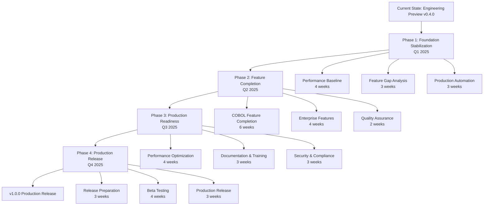
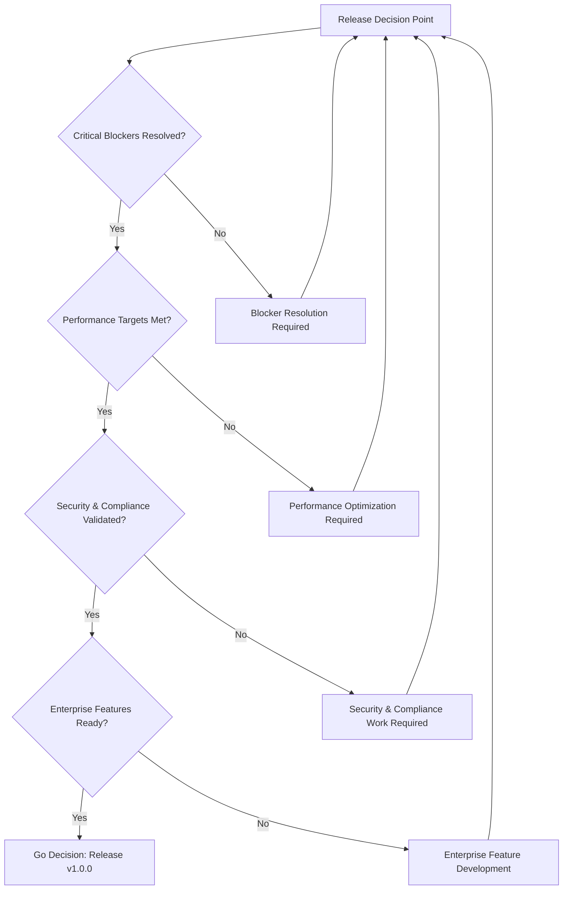
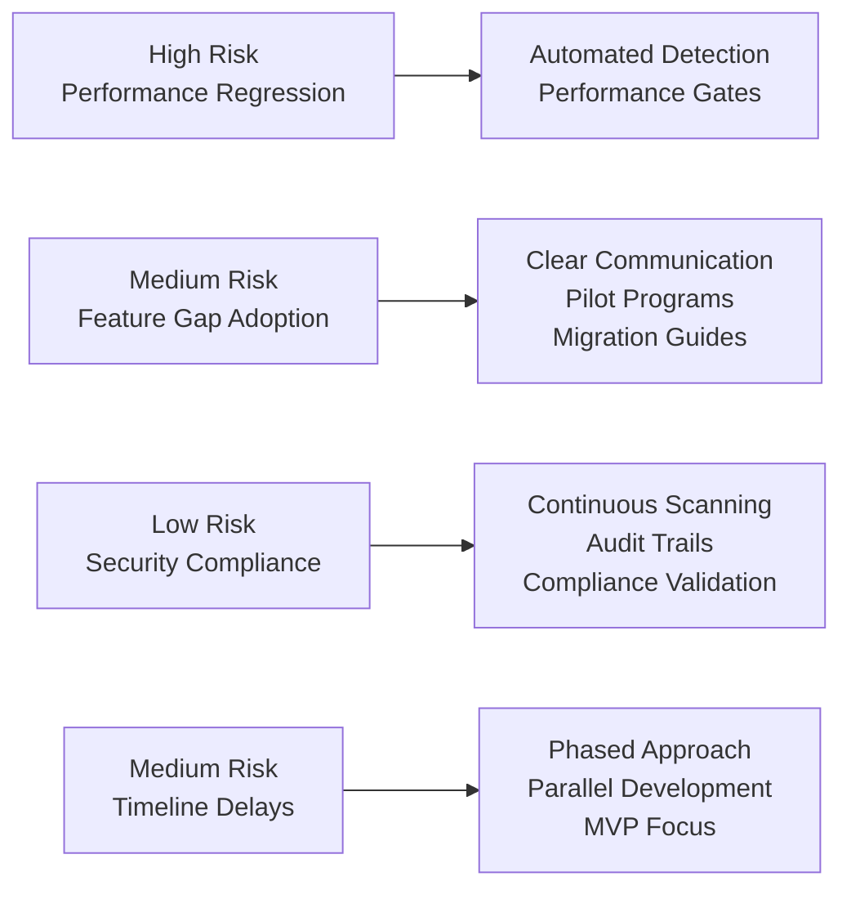
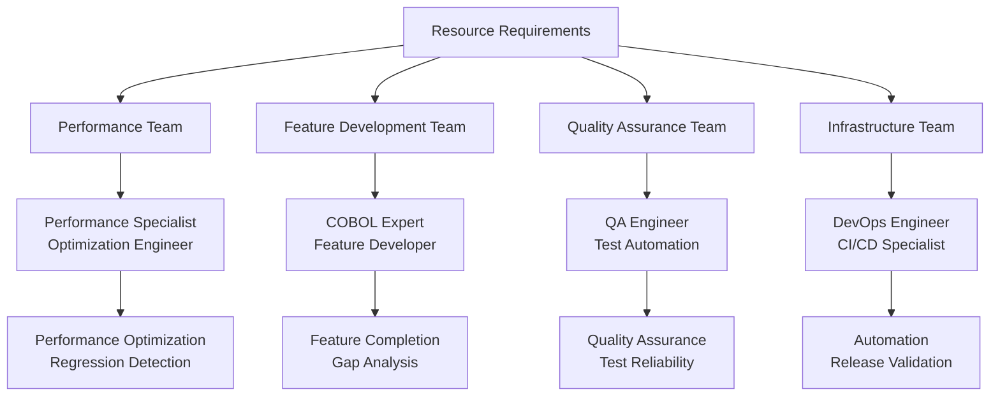
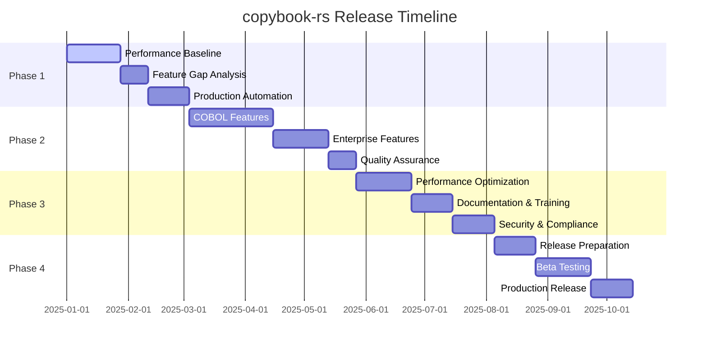

<!-- SPDX-License-Identifier: AGPL-3.0-or-later -->
# copybook-rs Release Roadmap Visualizations

## Release Phase Flow Diagram



## Decision Framework Flow



## Risk Assessment Matrix



## Resource Allocation Strategy



## Timeline Dependencies



## Stakeholder Decision Flow

```mermaid
graph TD
    A[Stakeholder Input] --> B[Executive Leadership]
    A --> C[Technical Team Leads]
    A --> D[Quality Assurance]
    A --> E[Security & Compliance]
    
    B --> F[Strategic Decisions<br/>Resource Allocation<br/>Timeline Approval<br/>Go/No-Go Authority]
    C --> G[Technical Feasibility<br/>Implementation Planning<br/>Resource Requirements]
    D --> H[Quality Gates<br/>Test Validation<br/>Release Criteria]
    E --> I[Security Validation<br/>Compliance Assessment<br/>Risk Mitigation]
    
    F --> J[Release Decision]
    G --> J
    H --> J
    I --> J
    
    J --> K[v1.0.0 Production Release]
    J --> L[Iterative Improvement<br/>Based on Feedback]