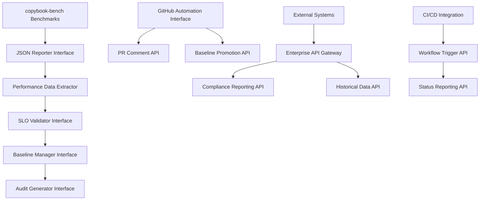

# Benchmark Reporting API Contracts and Integration Specifications

## Document Information

- **Document Type**: API Contracts and Integration Specification
- **Component**: copybook-bench Integration Interfaces
- **Issue**: #52 - Machine-Readable Benchmark Reporting Infrastructure
- **Status**: Implementation Ready
- **Version**: 1.0
- **Date**: 2025-09-28

## Overview

This specification defines comprehensive API contracts and integration interfaces for the machine-readable benchmark reporting infrastructure. These contracts ensure seamless integration with the existing copybook-bench infrastructure while providing enterprise-grade automation and compliance capabilities.

## API Architecture Overview



## Core API Interfaces

### 1. JSON Reporter Interface

**Purpose**: Main interface for generating machine-readable performance reports from benchmark results.

```rust
/// Primary interface for JSON report generation from benchmark data
pub trait JsonReporter: Send + Sync {
    /// Generate comprehensive performance report from benchmark execution
    fn generate_performance_report(
        &self,
        benchmark_results: &BenchmarkExecutionResult,
        options: &ReportGenerationOptions,
    ) -> Result<PerformanceReport, ReportingError>;

    /// Validate generated report against JSON schema
    fn validate_report(&self, report: &PerformanceReport) -> Result<ValidationResult, ValidationError>;

    /// Save report to filesystem with atomic write
    fn save_report(&self, report: &PerformanceReport, path: &Path) -> Result<(), IoError>;

    /// Load existing report from filesystem
    fn load_report(&self, path: &Path) -> Result<PerformanceReport, IoError>;

    /// Extract metrics from raw criterion output
    fn extract_metrics_from_criterion(&self, criterion_output: &str) -> Result<ExtractedMetrics, ExtractionError>;
}

/// Implementation of JSON reporter for copybook-bench integration
#[derive(Debug, Clone)]
pub struct CopybookJsonReporter {
    schema_validator: SchemaValidator,
    metric_extractor: MetricExtractor,
    environment_collector: EnvironmentCollector,
}

impl JsonReporter for CopybookJsonReporter {
    fn generate_performance_report(
        &self,
        benchmark_results: &BenchmarkExecutionResult,
        options: &ReportGenerationOptions,
    ) -> Result<PerformanceReport, ReportingError> {
        // 1. Extract performance metrics
        let metrics = self.extract_performance_metrics(benchmark_results)?;

        // 2. Validate SLO compliance
        let slo_validation = self.validate_slo_compliance(&metrics, options)?;

        // 3. Collect environment context
        let environment_context = self.environment_collector.collect_environment_data()?;

        // 4. Generate statistical analysis
        let statistical_analysis = self.generate_statistical_analysis(&metrics, benchmark_results)?;

        // 5. Create comprehensive report
        let report = PerformanceReport {
            schema_version: "1.0".to_string(),
            generation_timestamp: SystemTime::now(),
            performance_metrics: metrics,
            slo_validation_result: slo_validation,
            environment_context,
            statistical_analysis,
            execution_metadata: self.create_execution_metadata(benchmark_results)?,
        };

        // 6. Validate against schema
        self.validate_report(&report)?;

        Ok(report)
    }

    fn validate_report(&self, report: &PerformanceReport) -> Result<ValidationResult, ValidationError> {
        self.schema_validator.validate_performance_report(report)
    }

    fn extract_metrics_from_criterion(&self, criterion_output: &str) -> Result<ExtractedMetrics, ExtractionError> {
        self.metric_extractor.extract_from_criterion_output(criterion_output)
    }
}

/// Performance report structure with comprehensive metadata
#[derive(Debug, Clone, Serialize, Deserialize)]
pub struct PerformanceReport {
    /// JSON schema version for compatibility tracking
    pub schema_version: String,

    /// Report generation timestamp
    pub generation_timestamp: SystemTime,

    /// Core performance metrics
    pub performance_metrics: PerformanceMetrics,

    /// SLO validation results
    pub slo_validation_result: SloValidationResult,

    /// Environment and execution context
    pub environment_context: EnvironmentContext,

    /// Statistical analysis of performance data
    pub statistical_analysis: StatisticalAnalysis,

    /// Execution metadata for traceability
    pub execution_metadata: ExecutionMetadata,
}

/// Core performance metrics extracted from benchmarks
#[derive(Debug, Clone, Serialize, Deserialize)]
pub struct PerformanceMetrics {
    /// DISPLAY-heavy processing throughput in GiB/s
    pub display_throughput: ThroughputMetrics,

    /// COMP-3-heavy processing throughput in MiB/s
    pub comp3_throughput: ThroughputMetrics,

    /// Memory usage metrics
    pub memory_usage: MemoryUsageMetrics,

    /// Latency metrics for responsiveness
    pub latency_metrics: LatencyMetrics,

    /// Parse time performance
    pub parse_performance: ParsePerformanceMetrics,
}

/// Throughput measurements with statistical properties
#[derive(Debug, Clone, Serialize, Deserialize)]
pub struct ThroughputMetrics {
    pub mean: f64,
    pub median: f64,
    pub std_deviation: f64,
    pub min: f64,
    pub max: f64,
    pub percentile_95: f64,
    pub percentile_99: f64,
    pub sample_size: usize,
    pub unit: String,
    pub confidence_interval: ConfidenceInterval,
}

/// Report generation options for customization
#[derive(Debug, Clone, Default)]
pub struct ReportGenerationOptions {
    pub include_statistical_analysis: bool,
    pub include_environment_details: bool,
    pub include_raw_benchmark_data: bool,
    pub slo_validation_config: SloValidationConfig,
    pub custom_metadata: HashMap<String, String>,
}
```

### 2. SLO Validator Interface

**Purpose**: Validates performance metrics against enterprise SLO floors and safety margins.

```rust
/// Interface for SLO validation and compliance assessment
pub trait SloValidator: Send + Sync {
    /// Validate performance metrics against enterprise floors
    fn validate_performance_floors(
        &self,
        metrics: &PerformanceMetrics,
        config: &SloValidationConfig,
    ) -> Result<SloValidationResult, ValidationError>;

    /// Calculate safety margins against minimum thresholds
    fn calculate_safety_margins(
        &self,
        metrics: &PerformanceMetrics,
    ) -> Result<SafetyMargins, CalculationError>;

    /// Assess enterprise readiness based on performance
    fn assess_enterprise_readiness(
        &self,
        metrics: &PerformanceMetrics,
        validation_result: &SloValidationResult,
    ) -> Result<EnterpriseReadinessAssessment, AssessmentError>;

    /// Generate performance recommendations
    fn generate_performance_recommendations(
        &self,
        validation_result: &SloValidationResult,
        safety_margins: &SafetyMargins,
    ) -> Result<Vec<PerformanceRecommendation>, RecommendationError>;
}

/// Enterprise SLO validator implementation
#[derive(Debug, Clone)]
pub struct EnterpriseSloValidator {
    performance_floors: PerformanceFloors,
    compliance_assessor: ComplianceAssessor,
    readiness_calculator: ReadinessCalculator,
}

impl SloValidator for EnterpriseSloValidator {
    fn validate_performance_floors(
        &self,
        metrics: &PerformanceMetrics,
        config: &SloValidationConfig,
    ) -> Result<SloValidationResult, ValidationError> {
        let mut warnings = Vec::new();
        let mut errors = Vec::new();
        let mut validation_details = Vec::new();

        // Validate DISPLAY throughput (convert GiB/s to MB/s)
        let display_mbps = metrics.display_throughput.mean * 1073.74;
        let display_validation = self.validate_display_throughput(
            display_mbps,
            &mut warnings,
            &mut errors,
        );
        validation_details.push(display_validation);

        // Validate COMP-3 throughput
        let comp3_validation = self.validate_comp3_throughput(
            metrics.comp3_throughput.mean,
            &mut warnings,
            &mut errors,
        );
        validation_details.push(comp3_validation);

        // Validate memory usage
        let memory_validation = self.validate_memory_usage(
            &metrics.memory_usage,
            &mut warnings,
            &mut errors,
        );
        validation_details.push(memory_validation);

        // Calculate safety margins
        let safety_margins = self.calculate_safety_margins(metrics)?;

        // Determine overall compliance level
        let compliance_level = self.determine_compliance_level(
            &errors,
            &warnings,
            &safety_margins,
        );

        Ok(SloValidationResult {
            passed: errors.is_empty(),
            warnings,
            errors,
            safety_margins,
            validation_details,
            compliance_level,
            validation_timestamp: SystemTime::now(),
        })
    }

    fn calculate_safety_margins(
        &self,
        metrics: &PerformanceMetrics,
    ) -> Result<SafetyMargins, CalculationError> {
        let display_mbps = metrics.display_throughput.mean * 1073.74;

        Ok(SafetyMargins {
            display_safety_factor: display_mbps / self.performance_floors.display_mbps_floor,
            comp3_safety_factor: metrics.comp3_throughput.mean / self.performance_floors.comp3_mbps_floor,
            memory_efficiency_score: self.calculate_memory_efficiency(&metrics.memory_usage)?,
            variance_stability_score: self.calculate_variance_stability(metrics)?,
            overall_readiness_score: self.calculate_overall_readiness(metrics)?,
        })
    }
}

/// SLO validation result with comprehensive diagnostics
#[derive(Debug, Clone, Serialize, Deserialize)]
pub struct SloValidationResult {
    pub passed: bool,
    pub warnings: Vec<String>,
    pub errors: Vec<String>,
    pub safety_margins: SafetyMargins,
    pub validation_details: Vec<MetricValidationDetail>,
    pub compliance_level: ComplianceLevel,
    pub validation_timestamp: SystemTime,
}

/// Safety margins calculation result
#[derive(Debug, Clone, Serialize, Deserialize)]
pub struct SafetyMargins {
    /// DISPLAY safety factor vs 80 MB/s floor (current: ~52x)
    pub display_safety_factor: f64,

    /// COMP-3 safety factor vs 40 MB/s floor (current: ~15x)
    pub comp3_safety_factor: f64,

    /// Memory efficiency score (0.0 to 1.0)
    pub memory_efficiency_score: f64,

    /// Variance stability score (0.0 to 1.0)
    pub variance_stability_score: f64,

    /// Overall enterprise readiness score (0.0 to 1.0)
    pub overall_readiness_score: f64,
}

/// SLO validation configuration
#[derive(Debug, Clone, Default)]
pub struct SloValidationConfig {
    pub custom_floors: Option<PerformanceFloors>,
    pub warning_thresholds: WarningThresholds,
    pub enterprise_mode: bool,
    pub statistical_validation: bool,
}
```

### 3. Baseline Manager Interface

**Purpose**: Manages performance baselines for regression detection and historical tracking.

```rust
/// Interface for baseline management and promotion workflows
pub trait BaselineManager: Send + Sync {
    /// Store new performance baseline
    fn store_baseline(
        &mut self,
        baseline: BaselineEntry,
        metadata: BaselineMetadata,
    ) -> Result<BaselineId, BaselineError>;

    /// Load baseline by ID
    fn load_baseline(&self, baseline_id: &BaselineId) -> Result<BaselineEntry, BaselineError>;

    /// Find compatible baseline for comparison
    fn find_compatible_baseline(
        &self,
        environment: &EnvironmentContext,
        criteria: &BaselineSelectionCriteria,
    ) -> Result<Option<BaselineEntry>, BaselineError>;

    /// Promote baseline after successful validation
    fn promote_baseline(
        &mut self,
        performance_report: &PerformanceReport,
        promotion_criteria: &PromotionCriteria,
    ) -> Result<BaselineId, PromotionError>;

    /// List available baselines with filtering
    fn list_baselines(
        &self,
        filter: &BaselineFilter,
    ) -> Result<Vec<BaselineMetadata>, BaselineError>;

    /// Validate baseline quality and consistency
    fn validate_baseline_quality(
        &self,
        baseline: &BaselineEntry,
    ) -> Result<BaselineQualityReport, ValidationError>;

    /// Clean up old baselines according to retention policy
    fn cleanup_old_baselines(
        &mut self,
        retention_policy: &RetentionPolicy,
    ) -> Result<CleanupReport, BaselineError>;
}

/// File-based baseline manager implementation
#[derive(Debug)]
pub struct FileBaselineManager {
    storage_root: PathBuf,
    index: BaselineIndex,
    retention_policy: RetentionPolicy,
    validation_engine: BaselineValidationEngine,
}

impl BaselineManager for FileBaselineManager {
    fn store_baseline(
        &mut self,
        baseline: BaselineEntry,
        metadata: BaselineMetadata,
    ) -> Result<BaselineId, BaselineError> {
        // Generate unique baseline ID
        let baseline_id = self.generate_baseline_id(&metadata);

        // Validate baseline before storage
        let quality_report = self.validate_baseline_quality(&baseline)?;
        if !quality_report.is_acceptable {
            return Err(BaselineError::QualityCheckFailed(quality_report));
        }

        // Store baseline data
        let baseline_path = self.get_baseline_path(&baseline_id);
        self.write_baseline_file(&baseline_path, &baseline)?;

        // Update index
        self.index.add_baseline_entry(baseline_id.clone(), metadata)?;

        // Trigger cleanup if needed
        if self.should_trigger_cleanup() {
            let _ = self.cleanup_old_baselines(&self.retention_policy);
        }

        Ok(baseline_id)
    }

    fn promote_baseline(
        &mut self,
        performance_report: &PerformanceReport,
        promotion_criteria: &PromotionCriteria,
    ) -> Result<BaselineId, PromotionError> {
        // Validate promotion criteria
        self.validate_promotion_criteria(performance_report, promotion_criteria)?;

        // Create baseline entry from performance report
        let baseline_entry = self.create_baseline_from_report(performance_report)?;

        // Create promotion metadata
        let metadata = BaselineMetadata {
            baseline_id: BaselineId::new(),
            creation_timestamp: SystemTime::now(),
            source: BaselineSource::PerformanceReport,
            environment_context: performance_report.environment_context.clone(),
            promotion_metadata: Some(PromotionMetadata {
                promoted_by: promotion_criteria.promoted_by.clone(),
                promotion_timestamp: SystemTime::now(),
                pr_number: promotion_criteria.pr_number,
                git_commit: promotion_criteria.git_commit.clone(),
            }),
            quality_score: self.calculate_baseline_quality_score(&baseline_entry)?,
        };

        // Store as new baseline
        let baseline_id = self.store_baseline(baseline_entry, metadata)?;

        // Update current baseline pointer if this is for main branch
        if promotion_criteria.update_current_baseline {
            self.update_current_baseline_pointer(&baseline_id)?;
        }

        Ok(baseline_id)
    }

    fn find_compatible_baseline(
        &self,
        environment: &EnvironmentContext,
        criteria: &BaselineSelectionCriteria,
    ) -> Result<Option<BaselineEntry>, BaselineError> {
        // Search index for compatible baselines
        let compatible_baselines = self.index.find_compatible_baselines(
            environment,
            criteria,
        )?;

        if compatible_baselines.is_empty() {
            return Ok(None);
        }

        // Select best baseline based on criteria
        let best_baseline_id = self.select_best_baseline(
            &compatible_baselines,
            criteria,
        )?;

        // Load and return the baseline
        self.load_baseline(&best_baseline_id).map(Some)
    }
}

/// Baseline entry containing performance data
#[derive(Debug, Clone, Serialize, Deserialize)]
pub struct BaselineEntry {
    pub baseline_id: BaselineId,
    pub performance_metrics: PerformanceMetrics,
    pub statistical_properties: StatisticalProperties,
    pub environment_context: EnvironmentContext,
    pub validation_results: BaselineValidationResults,
}

/// Baseline metadata for indexing and management
#[derive(Debug, Clone, Serialize, Deserialize)]
pub struct BaselineMetadata {
    pub baseline_id: BaselineId,
    pub creation_timestamp: SystemTime,
    pub source: BaselineSource,
    pub environment_context: EnvironmentContext,
    pub promotion_metadata: Option<PromotionMetadata>,
    pub quality_score: f64,
}

/// Baseline promotion criteria
#[derive(Debug, Clone)]
pub struct PromotionCriteria {
    pub minimum_quality_score: f64,
    pub required_safety_margins: SafetyMargins,
    pub pr_number: Option<u64>,
    pub git_commit: Option<String>,
    pub promoted_by: String,
    pub update_current_baseline: bool,
}

/// Unique baseline identifier
#[derive(Debug, Clone, PartialEq, Eq, Hash, Serialize, Deserialize)]
pub struct BaselineId(String);

impl BaselineId {
    pub fn new() -> Self {
        use std::time::{SystemTime, UNIX_EPOCH};
        let timestamp = SystemTime::now()
            .duration_since(UNIX_EPOCH)
            .unwrap_or_default()
            .as_secs();

        Self(format!("baseline_{:x}_{}", timestamp, uuid::Uuid::new_v4().simple()))
    }

    pub fn from_string(s: String) -> Self {
        Self(s)
    }
}
```

### 4. Audit Generator Interface

**Purpose**: Generates comprehensive enterprise audit reports with regulatory compliance.

```rust
/// Interface for enterprise audit report generation
pub trait AuditGenerator: Send + Sync {
    /// Generate comprehensive enterprise audit report
    fn generate_comprehensive_audit(
        &self,
        audit_config: &AuditConfiguration,
        time_period: &AuditTimePeriod,
    ) -> Result<ComprehensiveAuditReport, AuditError>;

    /// Generate compliance assessment for specific standards
    fn generate_compliance_assessment(
        &self,
        performance_data: &HistoricalPerformanceData,
        standards: &[ComplianceStandard],
    ) -> Result<ComplianceAssessment, ComplianceError>;

    /// Generate regulatory validation report
    fn generate_regulatory_validation(
        &self,
        performance_data: &HistoricalPerformanceData,
        frameworks: &[RegulatoryFramework],
    ) -> Result<RegulatoryValidationReport, RegulatoryError>;

    /// Generate trend analysis report
    fn generate_trend_analysis(
        &self,
        performance_data: &HistoricalPerformanceData,
        analysis_config: &TrendAnalysisConfig,
    ) -> Result<TrendAnalysisReport, TrendAnalysisError>;

    /// Export audit report in specified format
    fn export_audit_report(
        &self,
        audit_report: &ComprehensiveAuditReport,
        format: &ExportFormat,
        output_path: &Path,
    ) -> Result<ExportResult, ExportError>;
}

/// Enterprise audit generator implementation
#[derive(Debug)]
pub struct EnterpriseAuditGenerator {
    historical_tracker: HistoricalPerformanceTracker,
    compliance_assessor: ComplianceAssessor,
    regulatory_validator: RegulatoryValidator,
    trend_analyzer: TrendAnalyzer,
    report_formatter: ReportFormatter,
}

impl AuditGenerator for EnterpriseAuditGenerator {
    fn generate_comprehensive_audit(
        &self,
        audit_config: &AuditConfiguration,
        time_period: &AuditTimePeriod,
    ) -> Result<ComprehensiveAuditReport, AuditError> {
        // 1. Collect historical performance data
        let historical_data = self.historical_tracker.collect_performance_history(time_period)?;

        // 2. Perform compliance assessment
        let compliance_assessment = self.generate_compliance_assessment(
            &historical_data,
            &audit_config.compliance_standards,
        )?;

        // 3. Execute regulatory validation
        let regulatory_validation = self.generate_regulatory_validation(
            &historical_data,
            &audit_config.regulatory_frameworks,
        )?;

        // 4. Analyze performance trends
        let trend_analysis = self.generate_trend_analysis(
            &historical_data,
            &audit_config.trend_analysis_config,
        )?;

        // 5. Generate executive summary
        let executive_summary = self.generate_executive_summary(
            &compliance_assessment,
            &regulatory_validation,
            &trend_analysis,
        )?;

        // 6. Create comprehensive report
        Ok(ComprehensiveAuditReport {
            audit_metadata: self.create_audit_metadata(audit_config, time_period),
            executive_summary,
            historical_performance_analysis: historical_data,
            compliance_assessment,
            regulatory_validation,
            trend_analysis,
            detailed_findings: self.generate_detailed_findings(&historical_data)?,
            recommendations: self.generate_audit_recommendations(
                &compliance_assessment,
                &regulatory_validation,
            )?,
            appendices: self.generate_audit_appendices(&historical_data)?,
        })
    }

    fn export_audit_report(
        &self,
        audit_report: &ComprehensiveAuditReport,
        format: &ExportFormat,
        output_path: &Path,
    ) -> Result<ExportResult, ExportError> {
        match format {
            ExportFormat::Html => self.report_formatter.export_as_html(audit_report, output_path),
            ExportFormat::Json => self.report_formatter.export_as_json(audit_report, output_path),
            ExportFormat::Pdf => self.report_formatter.export_as_pdf(audit_report, output_path),
            ExportFormat::Xlsx => self.report_formatter.export_as_excel(audit_report, output_path),
        }
    }
}

/// Comprehensive enterprise audit report
#[derive(Debug, Clone, Serialize, Deserialize)]
pub struct ComprehensiveAuditReport {
    pub audit_metadata: AuditMetadata,
    pub executive_summary: ExecutiveSummary,
    pub historical_performance_analysis: HistoricalPerformanceData,
    pub compliance_assessment: ComplianceAssessment,
    pub regulatory_validation: RegulatoryValidationReport,
    pub trend_analysis: TrendAnalysisReport,
    pub detailed_findings: DetailedFindings,
    pub recommendations: Vec<AuditRecommendation>,
    pub appendices: AuditAppendices,
}

/// Audit configuration for report generation
#[derive(Debug, Clone, Serialize, Deserialize)]
pub struct AuditConfiguration {
    pub audit_scope: AuditScope,
    pub compliance_standards: Vec<ComplianceStandard>,
    pub regulatory_frameworks: Vec<RegulatoryFramework>,
    pub trend_analysis_config: TrendAnalysisConfig,
    pub export_formats: Vec<ExportFormat>,
    pub include_detailed_analysis: bool,
    pub include_raw_data: bool,
}

/// Export format options
#[derive(Debug, Clone, Serialize, Deserialize)]
pub enum ExportFormat {
    Html,
    Json,
    Pdf,
    Xlsx,
}
```

### 5. GitHub Integration Interface

**Purpose**: Provides GitHub API integration for PR automation and baseline management.

```rust
/// Interface for GitHub PR automation and integration
pub trait GitHubIntegrator: Send + Sync {
    /// Post performance comment to pull request
    fn post_performance_comment(
        &self,
        pr_number: u64,
        performance_report: &PerformanceReport,
        comment_config: &CommentConfiguration,
    ) -> Result<CommentResult, GitHubError>;

    /// Update existing performance comment
    fn update_performance_comment(
        &self,
        comment_id: u64,
        performance_report: &PerformanceReport,
        comment_config: &CommentConfiguration,
    ) -> Result<CommentResult, GitHubError>;

    /// Trigger baseline promotion on PR merge
    fn trigger_baseline_promotion(
        &self,
        pr_number: u64,
        performance_report: &PerformanceReport,
    ) -> Result<PromotionResult, GitHubError>;

    /// Create performance tracking issue
    fn create_performance_issue(
        &self,
        issue_config: &IssueConfiguration,
        performance_data: &PerformanceReport,
    ) -> Result<IssueResult, GitHubError>;

    /// Update PR status checks
    fn update_status_checks(
        &self,
        commit_sha: &str,
        status_checks: &[StatusCheck],
    ) -> Result<StatusUpdateResult, GitHubError>;
}

/// GitHub integrator implementation
#[derive(Debug, Clone)]
pub struct GitHubApiIntegrator {
    client: GitHubApiClient,
    config: GitHubIntegrationConfig,
    comment_formatter: CommentFormatter,
}

impl GitHubIntegrator for GitHubApiIntegrator {
    fn post_performance_comment(
        &self,
        pr_number: u64,
        performance_report: &PerformanceReport,
        comment_config: &CommentConfiguration,
    ) -> Result<CommentResult, GitHubError> {
        // Format performance comment
        let comment_body = self.comment_formatter.format_performance_comment(
            performance_report,
            comment_config,
        )?;

        // Check for existing performance comment
        if let Some(existing_comment_id) = self.find_existing_performance_comment(pr_number)? {
            // Update existing comment
            self.update_performance_comment(existing_comment_id, performance_report, comment_config)
        } else {
            // Create new comment
            let comment_result = self.client.create_issue_comment(
                pr_number,
                &comment_body,
            )?;

            Ok(CommentResult {
                comment_id: comment_result.id,
                comment_url: comment_result.html_url,
                action: CommentAction::Created,
            })
        }
    }

    fn trigger_baseline_promotion(
        &self,
        pr_number: u64,
        performance_report: &PerformanceReport,
    ) -> Result<PromotionResult, GitHubError> {
        // Verify PR is merged
        let pr_details = self.client.get_pull_request(pr_number)?;
        if !pr_details.merged {
            return Err(GitHubError::PrNotMerged(pr_number));
        }

        // Trigger baseline promotion workflow
        let workflow_result = self.client.trigger_workflow(
            "baseline-promotion",
            &WorkflowInputs {
                pr_number: pr_number.to_string(),
                force_promotion: false,
            },
        )?;

        Ok(PromotionResult {
            workflow_run_id: workflow_result.id,
            workflow_url: workflow_result.html_url,
            promotion_status: PromotionStatus::Triggered,
        })
    }
}

/// GitHub integration configuration
#[derive(Debug, Clone)]
pub struct GitHubIntegrationConfig {
    pub repository: String,
    pub token: String,
    pub api_base_url: String,
    pub timeout_seconds: u64,
    pub retry_attempts: u32,
}

/// Performance comment configuration
#[derive(Debug, Clone, Default)]
pub struct CommentConfiguration {
    pub include_detailed_metrics: bool,
    pub include_safety_margins: bool,
    pub include_trend_comparison: bool,
    pub include_compliance_status: bool,
    pub custom_footer: Option<String>,
}

/// Comment operation result
#[derive(Debug, Clone)]
pub struct CommentResult {
    pub comment_id: u64,
    pub comment_url: String,
    pub action: CommentAction,
}

#[derive(Debug, Clone)]
pub enum CommentAction {
    Created,
    Updated,
    Skipped,
}
```

## Integration Workflow Examples

### 1. Basic Performance Validation Workflow

```rust
use copybook_bench::json_reporter::CopybookJsonReporter;
use copybook_bench::slo_validator::EnterpriseSloValidator;

/// Example integration for basic performance validation
pub async fn validate_performance_and_report(
    benchmark_results: BenchmarkExecutionResult,
) -> Result<PerformanceValidationResult, Box<dyn std::error::Error>> {
    // 1. Create reporter and validator
    let reporter = CopybookJsonReporter::new();
    let validator = EnterpriseSloValidator::new();

    // 2. Generate performance report
    let report_options = ReportGenerationOptions::default();
    let performance_report = reporter.generate_performance_report(
        &benchmark_results,
        &report_options,
    )?;

    // 3. Validate SLO compliance
    let slo_config = SloValidationConfig::default();
    let validation_result = validator.validate_performance_floors(
        &performance_report.performance_metrics,
        &slo_config,
    )?;

    // 4. Calculate safety margins
    let safety_margins = validator.calculate_safety_margins(
        &performance_report.performance_metrics,
    )?;

    // 5. Generate recommendations if needed
    let recommendations = if !validation_result.passed {
        validator.generate_performance_recommendations(
            &validation_result,
            &safety_margins,
        )?
    } else {
        Vec::new()
    };

    Ok(PerformanceValidationResult {
        performance_report,
        validation_result,
        safety_margins,
        recommendations,
    })
}
```

### 2. Complete CI Integration Workflow

```rust
/// Complete CI integration workflow example
pub async fn ci_performance_workflow(
    pr_number: Option<u64>,
    git_commit: String,
) -> Result<CiWorkflowResult, Box<dyn std::error::Error>> {
    // 1. Execute benchmarks
    let benchmark_executor = BenchmarkExecutor::new();
    let benchmark_results = benchmark_executor.execute_full_benchmark_suite().await?;

    // 2. Generate performance report
    let reporter = CopybookJsonReporter::new();
    let performance_report = reporter.generate_performance_report(
        &benchmark_results,
        &ReportGenerationOptions::ci_mode(),
    )?;

    // 3. Validate against SLOs
    let validator = EnterpriseSloValidator::new();
    let validation_result = validator.validate_performance_floors(
        &performance_report.performance_metrics,
        &SloValidationConfig::ci_mode(),
    )?;

    // 4. Post PR comment if this is a PR
    if let Some(pr_num) = pr_number {
        let github_integrator = GitHubApiIntegrator::from_env()?;
        github_integrator.post_performance_comment(
            pr_num,
            &performance_report,
            &CommentConfiguration::default(),
        )?;
    }

    // 5. Update status checks
    let status_checks = vec![
        StatusCheck {
            context: "performance/slo-validation".to_string(),
            state: if validation_result.passed {
                StatusState::Success
            } else {
                StatusState::Failure
            },
            description: format!(
                "SLO validation: {} errors, {} warnings",
                validation_result.errors.len(),
                validation_result.warnings.len()
            ),
        },
    ];

    let github_integrator = GitHubApiIntegrator::from_env()?;
    github_integrator.update_status_checks(&git_commit, &status_checks)?;

    Ok(CiWorkflowResult {
        performance_report,
        validation_result,
        ci_status: if validation_result.passed {
            CiStatus::Passed
        } else {
            CiStatus::Failed
        },
    })
}
```

### 3. Enterprise Audit Generation Workflow

```rust
/// Enterprise audit generation workflow example
pub async fn generate_enterprise_audit(
    audit_period_days: u32,
    compliance_standards: Vec<ComplianceStandard>,
) -> Result<AuditGenerationResult, Box<dyn std::error::Error>> {
    // 1. Configure audit parameters
    let audit_config = AuditConfiguration {
        audit_scope: AuditScope::comprehensive(),
        compliance_standards,
        regulatory_frameworks: vec![
            RegulatoryFramework::FederalFinancialInstitutions,
        ],
        trend_analysis_config: TrendAnalysisConfig::default(),
        export_formats: vec![ExportFormat::Html, ExportFormat::Json],
        include_detailed_analysis: true,
        include_raw_data: false,
    };

    let time_period = AuditTimePeriod {
        start_date: Utc::now() - Duration::days(audit_period_days as i64),
        end_date: Utc::now(),
        granularity: TimeGranularity::Daily,
        timezone: "UTC".to_string(),
        business_days_only: false,
        excluded_periods: Vec::new(),
    };

    // 2. Generate comprehensive audit
    let audit_generator = EnterpriseAuditGenerator::new();
    let audit_report = audit_generator.generate_comprehensive_audit(
        &audit_config,
        &time_period,
    )?;

    // 3. Export in multiple formats
    let mut export_results = Vec::new();
    for format in &audit_config.export_formats {
        let output_path = PathBuf::from(format!(
            "audit_report_{}.{}",
            Utc::now().format("%Y%m%d_%H%M%S"),
            format.file_extension()
        ));

        let export_result = audit_generator.export_audit_report(
            &audit_report,
            format,
            &output_path,
        )?;

        export_results.push(export_result);
    }

    Ok(AuditGenerationResult {
        audit_report,
        export_results,
        generation_duration: std::time::Instant::now().elapsed(),
    })
}
```

This comprehensive API contract specification provides enterprise-grade integration interfaces while maintaining clean abstractions and comprehensive error handling for seamless copybook-bench integration.