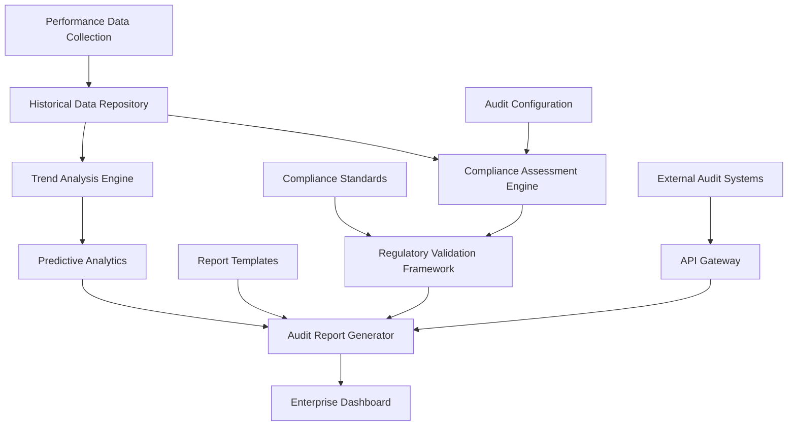

# Enterprise Audit and Compliance Reporting Specification

## Document Information

- **Document Type**: Enterprise Audit and Compliance Reporting Specification
- **Component**: Regulatory Compliance and Enterprise Audit Framework
- **Issue**: #52 - Machine-Readable Benchmark Reporting Infrastructure
- **Status**: Implementation Ready
- **Version**: 1.0
- **Date**: 2025-09-28

## Overview

This specification defines a comprehensive enterprise audit and compliance reporting framework for copybook-rs performance monitoring. The system provides regulatory compliance validation, historical performance tracking, and comprehensive audit trail generation required for enterprise mainframe data processing deployments.

## Enterprise Audit Framework

### Audit Architecture Overview



### Core Audit Components

```rust
/// Enterprise audit framework for regulatory compliance
#[derive(Debug, Clone)]
pub struct EnterpriseAuditFramework {
    historical_tracker: HistoricalPerformanceTracker,
    compliance_assessor: ComplianceAssessor,
    regulatory_validator: RegulatoryValidator,
    audit_reporter: AuditReporter,
    trend_analyzer: TrendAnalyzer,
    risk_assessor: RiskAssessor,
}

impl EnterpriseAuditFramework {
    /// Generate comprehensive enterprise audit report
    pub fn generate_comprehensive_audit(
        &self,
        audit_config: &AuditConfiguration,
        time_period: &AuditTimePeriod,
    ) -> Result<ComprehensiveAuditReport, AuditError> {
        // 1. Collect historical performance data
        let historical_data = self.historical_tracker.collect_performance_history(time_period)?;

        // 2. Perform compliance assessment
        let compliance_assessment = self.compliance_assessor.assess_compliance(
            &historical_data,
            &audit_config.compliance_standards,
        )?;

        // 3. Execute regulatory validation
        let regulatory_validation = self.regulatory_validator.validate_regulatory_requirements(
            &historical_data,
            &audit_config.regulatory_frameworks,
        )?;

        // 4. Analyze performance trends
        let trend_analysis = self.trend_analyzer.analyze_performance_trends(
            &historical_data,
            &audit_config.trend_analysis_config,
        )?;

        // 5. Assess enterprise risks
        let risk_assessment = self.risk_assessor.assess_enterprise_risks(
            &compliance_assessment,
            &regulatory_validation,
            &trend_analysis,
        )?;

        // 6. Generate audit recommendations
        let recommendations = self.generate_audit_recommendations(
            &compliance_assessment,
            &regulatory_validation,
            &risk_assessment,
        )?;

        // 7. Create comprehensive report
        let audit_report = ComprehensiveAuditReport {
            audit_metadata: self.create_audit_metadata(audit_config, time_period),
            executive_summary: self.create_executive_summary(&compliance_assessment, &risk_assessment),
            historical_performance_analysis: historical_data,
            compliance_assessment,
            regulatory_validation,
            trend_analysis,
            risk_assessment,
            recommendations,
            appendices: self.create_audit_appendices(&historical_data),
        };

        Ok(audit_report)
    }
}

/// Audit configuration for enterprise reporting
#[derive(Debug, Clone, Serialize, Deserialize)]
pub struct AuditConfiguration {
    pub audit_scope: AuditScope,
    pub compliance_standards: Vec<ComplianceStandard>,
    pub regulatory_frameworks: Vec<RegulatoryFramework>,
    pub performance_thresholds: PerformanceThresholds,
    pub trend_analysis_config: TrendAnalysisConfig,
    pub risk_tolerance: RiskTolerance,
    pub reporting_requirements: ReportingRequirements,
}

/// Audit scope definition
#[derive(Debug, Clone, Serialize, Deserialize)]
pub struct AuditScope {
    pub included_systems: Vec<String>,
    pub performance_metrics: Vec<String>,
    pub data_sources: Vec<String>,
    pub audit_objectives: Vec<AuditObjective>,
    pub exclusions: Vec<String>,
}

/// Audit objectives for enterprise compliance
#[derive(Debug, Clone, Serialize, Deserialize)]
pub enum AuditObjective {
    PerformanceCompliance,      // Validate performance against SLOs
    DataIntegrity,              // Ensure data processing integrity
    SecurityCompliance,         // Validate security controls
    OperationalEfficiency,      // Assess operational efficiency
    RegulatoryCompliance,       // Ensure regulatory compliance
    RiskAssessment,            // Identify and assess risks
}

/// Compliance standards for enterprise validation
#[derive(Debug, Clone, Serialize, Deserialize)]
pub enum ComplianceStandard {
    SarbanesOxley,             // SOX compliance for financial institutions
    PciDss,                    // Payment Card Industry Data Security Standard
    HipaaHitech,               // Healthcare compliance
    Gdpr,                      // General Data Protection Regulation
    Iso27001,                  // Information Security Management
    Nist,                      // NIST Cybersecurity Framework
    Custom(String),            // Custom enterprise standards
}

/// Regulatory frameworks for validation
#[derive(Debug, Clone, Serialize, Deserialize)]
pub enum RegulatoryFramework {
    FederalFinancialInstitutions,    // Federal financial regulations
    EuropeanBankingAuthority,        // European banking regulations
    HealthcareCompliance,            // Healthcare regulatory requirements
    EnergyUtilityCompliance,         // Energy and utility regulations
    ManufacturingCompliance,         // Manufacturing industry regulations
    Custom(CustomRegulatoryFramework),
}

#[derive(Debug, Clone, Serialize, Deserialize)]
pub struct CustomRegulatoryFramework {
    pub name: String,
    pub requirements: Vec<RegulatoryRequirement>,
    pub validation_criteria: Vec<ValidationCriterion>,
}
```

### Historical Performance Tracking

```rust
/// Historical performance tracking for audit compliance
#[derive(Debug)]
pub struct HistoricalPerformanceTracker {
    data_repository: PerformanceDataRepository,
    aggregation_engine: DataAggregationEngine,
    integrity_validator: DataIntegrityValidator,
    retention_manager: DataRetentionManager,
}

impl HistoricalPerformanceTracker {
    /// Collect comprehensive performance history for audit period
    pub fn collect_performance_history(
        &self,
        time_period: &AuditTimePeriod,
    ) -> Result<HistoricalPerformanceData, HistoricalDataError> {
        // 1. Retrieve raw performance data
        let raw_data = self.data_repository.query_performance_data(time_period)?;

        // 2. Validate data integrity
        let integrity_report = self.integrity_validator.validate_data_integrity(&raw_data)?;
        if !integrity_report.is_valid {
            return Err(HistoricalDataError::IntegrityViolation(integrity_report));
        }

        // 3. Aggregate data for analysis
        let aggregated_data = self.aggregation_engine.aggregate_performance_data(
            &raw_data,
            &AggregationConfig::for_audit(),
        )?;

        // 4. Calculate statistical properties
        let statistical_properties = self.calculate_statistical_properties(&aggregated_data)?;

        // 5. Identify anomalies and outliers
        let anomaly_detection = self.detect_performance_anomalies(&aggregated_data)?;

        // 6. Create data quality report
        let data_quality_report = self.assess_data_quality(&raw_data, &aggregated_data)?;

        Ok(HistoricalPerformanceData {
            time_period: time_period.clone(),
            raw_data_summary: self.summarize_raw_data(&raw_data),
            aggregated_metrics: aggregated_data,
            statistical_properties,
            anomaly_detection,
            data_quality_report,
            integrity_report,
            collection_metadata: self.create_collection_metadata(),
        })
    }

    /// Calculate comprehensive statistical properties
    fn calculate_statistical_properties(
        &self,
        data: &AggregatedPerformanceData,
    ) -> Result<StatisticalProperties, StatisticalError> {
        let mut properties = StatisticalProperties::new();

        // Calculate for each metric type
        for (metric_name, time_series) in &data.metric_time_series {
            let metric_stats = self.calculate_metric_statistics(time_series)?;
            properties.metric_statistics.insert(metric_name.clone(), metric_stats);
        }

        // Calculate cross-metric correlations
        properties.correlation_matrix = self.calculate_correlation_matrix(data)?;

        // Calculate trend indicators
        properties.trend_indicators = self.calculate_trend_indicators(data)?;

        // Calculate stability metrics
        properties.stability_metrics = self.calculate_stability_metrics(data)?;

        Ok(properties)
    }

    /// Detect performance anomalies using multiple methods
    fn detect_performance_anomalies(
        &self,
        data: &AggregatedPerformanceData,
    ) -> Result<AnomalyDetectionReport, AnomalyDetectionError> {
        let mut anomalies = Vec::new();

        for (metric_name, time_series) in &data.metric_time_series {
            // Statistical outlier detection (IQR method)
            let statistical_outliers = self.detect_statistical_outliers(time_series)?;

            // Time series anomaly detection
            let time_series_anomalies = self.detect_time_series_anomalies(time_series)?;

            // Seasonal anomaly detection
            let seasonal_anomalies = self.detect_seasonal_anomalies(time_series)?;

            anomalies.extend(statistical_outliers);
            anomalies.extend(time_series_anomalies);
            anomalies.extend(seasonal_anomalies);
        }

        Ok(AnomalyDetectionReport {
            anomalies,
            detection_methods: vec![
                "Statistical Outlier Detection (IQR)".to_string(),
                "Time Series Anomaly Detection".to_string(),
                "Seasonal Pattern Analysis".to_string(),
            ],
            confidence_levels: self.calculate_anomaly_confidence_levels(&anomalies),
        })
    }
}

/// Historical performance data structure
#[derive(Debug, Clone, Serialize, Deserialize)]
pub struct HistoricalPerformanceData {
    pub time_period: AuditTimePeriod,
    pub raw_data_summary: RawDataSummary,
    pub aggregated_metrics: AggregatedPerformanceData,
    pub statistical_properties: StatisticalProperties,
    pub anomaly_detection: AnomalyDetectionReport,
    pub data_quality_report: DataQualityReport,
    pub integrity_report: DataIntegrityReport,
    pub collection_metadata: CollectionMetadata,
}

/// Audit time period specification
#[derive(Debug, Clone, Serialize, Deserialize)]
pub struct AuditTimePeriod {
    pub start_date: DateTime<Utc>,
    pub end_date: DateTime<Utc>,
    pub granularity: TimeGranularity,
    pub timezone: String,
    pub business_days_only: bool,
    pub excluded_periods: Vec<ExcludedPeriod>,
}

#[derive(Debug, Clone, Serialize, Deserialize)]
pub enum TimeGranularity {
    Hourly,
    Daily,
    Weekly,
    Monthly,
    Custom(Duration),
}
```

### Compliance Assessment Engine

```rust
/// Compliance assessment engine for enterprise standards
#[derive(Debug)]
pub struct ComplianceAssessor {
    standards_registry: ComplianceStandardsRegistry,
    assessment_engine: AssessmentEngine,
    validation_framework: ValidationFramework,
    scoring_engine: ComplianceScoringEngine,
}

impl ComplianceAssessor {
    /// Assess compliance against enterprise standards
    pub fn assess_compliance(
        &self,
        performance_data: &HistoricalPerformanceData,
        standards: &[ComplianceStandard],
    ) -> Result<ComplianceAssessment, ComplianceError> {
        let mut assessments = Vec::new();

        for standard in standards {
            let standard_assessment = self.assess_individual_standard(
                performance_data,
                standard,
            )?;
            assessments.push(standard_assessment);
        }

        // Calculate overall compliance score
        let overall_score = self.scoring_engine.calculate_overall_compliance_score(&assessments)?;

        // Identify compliance gaps
        let compliance_gaps = self.identify_compliance_gaps(&assessments)?;

        // Generate compliance recommendations
        let recommendations = self.generate_compliance_recommendations(&assessments, &compliance_gaps)?;

        Ok(ComplianceAssessment {
            overall_compliance_score: overall_score,
            individual_assessments: assessments,
            compliance_gaps,
            recommendations,
            assessment_metadata: self.create_assessment_metadata(),
        })
    }

    /// Assess compliance against individual standard
    fn assess_individual_standard(
        &self,
        performance_data: &HistoricalPerformanceData,
        standard: &ComplianceStandard,
    ) -> Result<IndividualComplianceAssessment, ComplianceError> {
        // Get standard definition
        let standard_definition = self.standards_registry.get_standard_definition(standard)?;

        // Validate requirements
        let requirement_validations = self.validate_standard_requirements(
            performance_data,
            &standard_definition.requirements,
        )?;

        // Calculate compliance score for this standard
        let compliance_score = self.scoring_engine.calculate_standard_compliance_score(
            &requirement_validations,
        )?;

        // Identify non-compliant areas
        let non_compliant_requirements = requirement_validations
            .iter()
            .filter(|v| !v.compliant)
            .cloned()
            .collect();

        Ok(IndividualComplianceAssessment {
            standard: standard.clone(),
            compliance_score,
            requirement_validations,
            non_compliant_requirements,
            risk_level: self.assess_compliance_risk_level(&compliance_score),
            remediation_actions: self.generate_remediation_actions(&non_compliant_requirements)?,
        })
    }
}

/// Compliance assessment result
#[derive(Debug, Clone, Serialize, Deserialize)]
pub struct ComplianceAssessment {
    pub overall_compliance_score: ComplianceScore,
    pub individual_assessments: Vec<IndividualComplianceAssessment>,
    pub compliance_gaps: Vec<ComplianceGap>,
    pub recommendations: Vec<ComplianceRecommendation>,
    pub assessment_metadata: AssessmentMetadata,
}

/// Individual compliance standard assessment
#[derive(Debug, Clone, Serialize, Deserialize)]
pub struct IndividualComplianceAssessment {
    pub standard: ComplianceStandard,
    pub compliance_score: ComplianceScore,
    pub requirement_validations: Vec<RequirementValidation>,
    pub non_compliant_requirements: Vec<RequirementValidation>,
    pub risk_level: ComplianceRiskLevel,
    pub remediation_actions: Vec<RemediationAction>,
}

/// Compliance score with detailed breakdown
#[derive(Debug, Clone, Serialize, Deserialize)]
pub struct ComplianceScore {
    pub overall_score: f64,          // 0.0 to 1.0
    pub weighted_score: f64,         // Weighted by requirement importance
    pub category_scores: HashMap<String, f64>,
    pub confidence_level: f64,       // Statistical confidence in score
    pub score_interpretation: ComplianceScoreInterpretation,
}

#[derive(Debug, Clone, Serialize, Deserialize)]
pub enum ComplianceScoreInterpretation {
    FullyCompliant,                  // Score >= 0.95
    SubstantiallyCompliant,          // Score >= 0.85
    PartiallyCompliant,              // Score >= 0.70
    MinimallyCompliant,              // Score >= 0.50
    NonCompliant,                    // Score < 0.50
}

/// Compliance gap identification
#[derive(Debug, Clone, Serialize, Deserialize)]
pub struct ComplianceGap {
    pub gap_id: String,
    pub description: String,
    pub affected_standards: Vec<ComplianceStandard>,
    pub severity: ComplianceGapSeverity,
    pub impact_assessment: ImpactAssessment,
    pub recommended_timeline: Timeline,
    pub estimated_effort: EffortEstimate,
}

#[derive(Debug, Clone, Serialize, Deserialize)]
pub enum ComplianceGapSeverity {
    Critical,                        // Immediate attention required
    High,                           // Address within 30 days
    Medium,                         // Address within 90 days
    Low,                           // Address within 180 days
}
```

### Regulatory Validation Framework

```rust
/// Regulatory validation framework for industry compliance
#[derive(Debug)]
pub struct RegulatoryValidator {
    regulatory_registry: RegulatoryFrameworkRegistry,
    validation_engine: RegulatoryValidationEngine,
    documentation_generator: ComplianceDocumentationGenerator,
    evidence_collector: EvidenceCollector,
}

impl RegulatoryValidator {
    /// Validate against regulatory requirements
    pub fn validate_regulatory_requirements(
        &self,
        performance_data: &HistoricalPerformanceData,
        frameworks: &[RegulatoryFramework],
    ) -> Result<RegulatoryValidationReport, RegulatoryError> {
        let mut framework_validations = Vec::new();

        for framework in frameworks {
            let framework_validation = self.validate_individual_framework(
                performance_data,
                framework,
            )?;
            framework_validations.push(framework_validation);
        }

        // Collect regulatory evidence
        let regulatory_evidence = self.evidence_collector.collect_regulatory_evidence(
            performance_data,
            frameworks,
        )?;

        // Generate compliance documentation
        let compliance_documentation = self.documentation_generator.generate_compliance_documentation(
            &framework_validations,
            &regulatory_evidence,
        )?;

        // Assess overall regulatory status
        let overall_status = self.assess_overall_regulatory_status(&framework_validations)?;

        Ok(RegulatoryValidationReport {
            overall_status,
            framework_validations,
            regulatory_evidence,
            compliance_documentation,
            validation_metadata: self.create_validation_metadata(),
        })
    }

    /// Validate individual regulatory framework
    fn validate_individual_framework(
        &self,
        performance_data: &HistoricalPerformanceData,
        framework: &RegulatoryFramework,
    ) -> Result<FrameworkValidationResult, RegulatoryError> {
        let framework_definition = self.regulatory_registry.get_framework_definition(framework)?;

        // Validate each regulatory requirement
        let mut requirement_results = Vec::new();
        for requirement in &framework_definition.requirements {
            let result = self.validation_engine.validate_requirement(
                performance_data,
                requirement,
            )?;
            requirement_results.push(result);
        }

        // Calculate compliance percentage
        let compliant_count = requirement_results.iter().filter(|r| r.compliant).count();
        let compliance_percentage = (compliant_count as f64 / requirement_results.len() as f64) * 100.0;

        // Determine validation status
        let validation_status = match compliance_percentage {
            p if p >= 100.0 => RegulatoryValidationStatus::FullyCompliant,
            p if p >= 95.0 => RegulatoryValidationStatus::SubstantiallyCompliant,
            p if p >= 85.0 => RegulatoryValidationStatus::PartiallyCompliant,
            _ => RegulatoryValidationStatus::NonCompliant,
        };

        Ok(FrameworkValidationResult {
            framework: framework.clone(),
            validation_status,
            compliance_percentage,
            requirement_results,
            critical_failures: self.identify_critical_failures(&requirement_results),
            remediation_priority: self.calculate_remediation_priority(&requirement_results),
        })
    }
}

/// Regulatory validation report
#[derive(Debug, Clone, Serialize, Deserialize)]
pub struct RegulatoryValidationReport {
    pub overall_status: OverallRegulatoryStatus,
    pub framework_validations: Vec<FrameworkValidationResult>,
    pub regulatory_evidence: RegulatoryEvidence,
    pub compliance_documentation: ComplianceDocumentation,
    pub validation_metadata: ValidationMetadata,
}

/// Overall regulatory status assessment
#[derive(Debug, Clone, Serialize, Deserialize)]
pub struct OverallRegulatoryStatus {
    pub status: RegulatoryComplianceStatus,
    pub compliance_summary: ComplianceSummary,
    pub risk_assessment: RegulatoryRiskAssessment,
    pub certification_readiness: CertificationReadiness,
}

#[derive(Debug, Clone, Serialize, Deserialize)]
pub enum RegulatoryComplianceStatus {
    FullyCompliant,
    ConditionallyCompliant,
    RequiresRemediation,
    NonCompliant,
}
```

### Audit Report Generation

```python
# scripts/bench/audit_generator.py
"""Enterprise audit report generation with regulatory compliance."""

import json
import logging
import pandas as pd
import numpy as np
from datetime import datetime, timezone, timedelta
from pathlib import Path
from typing import Dict, List, Any, Optional, Tuple
from dataclasses import dataclass, asdict
from jinja2 import Environment, FileSystemLoader
import matplotlib.pyplot as plt
import seaborn as sns
from reportlab.lib.pagesizes import letter, A4
from reportlab.platypus import SimpleDocTemplate, Paragraph, Spacer, Table, TableStyle, PageBreak
from reportlab.lib.styles import getSampleStyleSheet, ParagraphStyle
from reportlab.lib.units import inch
from reportlab.lib.colors import Color

@dataclass
class AuditConfiguration:
    """Configuration for enterprise audit generation"""
    audit_period_days: int = 30
    compliance_standards: List[str] = None
    regulatory_frameworks: List[str] = None
    performance_thresholds: Dict[str, float] = None
    report_formats: List[str] = None
    include_detailed_analysis: bool = True
    include_trend_analysis: bool = True
    include_risk_assessment: bool = True

    def __post_init__(self):
        if self.compliance_standards is None:
            self.compliance_standards = ['SOX', 'PCI-DSS']
        if self.regulatory_frameworks is None:
            self.regulatory_frameworks = ['Federal_Financial_Institutions']
        if self.performance_thresholds is None:
            self.performance_thresholds = {
                'display_mbps_floor': 80.0,
                'comp3_mbps_floor': 40.0,
                'memory_mb_ceiling': 256.0
            }
        if self.report_formats is None:
            self.report_formats = ['html', 'json']

class EnterpriseAuditGenerator:
    """Comprehensive enterprise audit report generator"""

    def __init__(self, config: AuditConfiguration = None):
        self.config = config or AuditConfiguration()
        self.logger = logging.getLogger(__name__)
        self.template_env = Environment(
            loader=FileSystemLoader('scripts/bench/templates'),
            autoescape=True
        )

    def generate_comprehensive_audit_report(
        self,
        historical_data_path: Path,
        output_path: Path
    ) -> Dict[str, Any]:
        """Generate comprehensive enterprise audit report"""
        try:
            self.logger.info("Starting comprehensive enterprise audit report generation")

            # 1. Load and validate historical data
            historical_data = self._load_historical_data(historical_data_path)

            # 2. Perform compliance assessment
            compliance_assessment = self._perform_compliance_assessment(historical_data)

            # 3. Execute regulatory validation
            regulatory_validation = self._perform_regulatory_validation(historical_data)

            # 4. Analyze performance trends
            trend_analysis = self._perform_trend_analysis(historical_data)

            # 5. Assess enterprise risks
            risk_assessment = self._perform_risk_assessment(
                compliance_assessment,
                regulatory_validation,
                trend_analysis
            )

            # 6. Generate executive summary
            executive_summary = self._generate_executive_summary(
                compliance_assessment,
                regulatory_validation,
                risk_assessment
            )

            # 7. Create comprehensive audit report
            audit_report = {
                'audit_metadata': self._create_audit_metadata(),
                'executive_summary': executive_summary,
                'compliance_assessment': compliance_assessment,
                'regulatory_validation': regulatory_validation,
                'trend_analysis': trend_analysis,
                'risk_assessment': risk_assessment,
                'detailed_findings': self._generate_detailed_findings(historical_data),
                'recommendations': self._generate_audit_recommendations(
                    compliance_assessment,
                    regulatory_validation,
                    risk_assessment
                ),
                'appendices': self._generate_audit_appendices(historical_data)
            }

            # 8. Generate reports in requested formats
            generated_reports = {}
            for format_type in self.config.report_formats:
                report_path = self._generate_report_format(audit_report, output_path, format_type)
                generated_reports[format_type] = str(report_path)

            self.logger.info("Enterprise audit report generation completed successfully")
            return {
                'status': 'success',
                'generated_reports': generated_reports,
                'audit_summary': executive_summary
            }

        except Exception as e:
            self.logger.error(f"Failed to generate enterprise audit report: {e}")
            raise

    def _perform_compliance_assessment(self, historical_data: Dict[str, Any]) -> Dict[str, Any]:
        """Perform comprehensive compliance assessment"""
        assessment = {
            'overall_compliance_score': 0.0,
            'standard_assessments': {},
            'compliance_gaps': [],
            'risk_indicators': []
        }

        for standard in self.config.compliance_standards:
            standard_assessment = self._assess_compliance_standard(historical_data, standard)
            assessment['standard_assessments'][standard] = standard_assessment

        # Calculate overall compliance score
        if assessment['standard_assessments']:
            scores = [sa['compliance_score'] for sa in assessment['standard_assessments'].values()]
            assessment['overall_compliance_score'] = sum(scores) / len(scores)

        # Identify compliance gaps
        assessment['compliance_gaps'] = self._identify_compliance_gaps(
            assessment['standard_assessments']
        )

        # Generate risk indicators
        assessment['risk_indicators'] = self._generate_compliance_risk_indicators(
            assessment['standard_assessments']
        )

        return assessment

    def _assess_compliance_standard(
        self,
        historical_data: Dict[str, Any],
        standard: str
    ) -> Dict[str, Any]:
        """Assess compliance against individual standard"""

        standard_requirements = self._get_standard_requirements(standard)
        requirement_validations = []

        for requirement in standard_requirements:
            validation = self._validate_requirement(historical_data, requirement)
            requirement_validations.append(validation)

        # Calculate compliance score
        compliant_count = sum(1 for v in requirement_validations if v['compliant'])
        compliance_score = (compliant_count / len(requirement_validations)) * 100.0

        # Determine compliance level
        compliance_level = self._determine_compliance_level(compliance_score)

        return {
            'standard': standard,
            'compliance_score': compliance_score,
            'compliance_level': compliance_level,
            'requirement_validations': requirement_validations,
            'critical_failures': [v for v in requirement_validations
                                if not v['compliant'] and v['criticality'] == 'critical'],
            'recommendations': self._generate_standard_recommendations(requirement_validations)
        }

    def _get_standard_requirements(self, standard: str) -> List[Dict[str, Any]]:
        """Get requirements for compliance standard"""
        requirements_map = {
            'SOX': [
                {
                    'id': 'SOX-302',
                    'description': 'Management assessment of internal controls',
                    'type': 'performance_monitoring',
                    'criticality': 'critical',
                    'validation_criteria': {
                        'continuous_monitoring': True,
                        'performance_thresholds': True,
                        'anomaly_detection': True
                    }
                },
                {
                    'id': 'SOX-404',
                    'description': 'Internal control over financial reporting',
                    'type': 'data_integrity',
                    'criticality': 'critical',
                    'validation_criteria': {
                        'data_accuracy': True,
                        'processing_reliability': True,
                        'audit_trail': True
                    }
                }
            ],
            'PCI-DSS': [
                {
                    'id': 'PCI-DSS-2.3',
                    'description': 'Encrypt all non-console administrative access',
                    'type': 'security_controls',
                    'criticality': 'critical',
                    'validation_criteria': {
                        'encryption_in_transit': True,
                        'access_logging': True
                    }
                },
                {
                    'id': 'PCI-DSS-10.2',
                    'description': 'Implement automated audit trails',
                    'type': 'audit_logging',
                    'criticality': 'high',
                    'validation_criteria': {
                        'comprehensive_logging': True,
                        'log_integrity': True,
                        'retention_compliance': True
                    }
                }
            ]
        }

        return requirements_map.get(standard, [])

    def _perform_regulatory_validation(self, historical_data: Dict[str, Any]) -> Dict[str, Any]:
        """Perform regulatory validation against industry frameworks"""
        validation = {
            'overall_status': 'unknown',
            'framework_validations': {},
            'regulatory_evidence': {},
            'certification_readiness': {}
        }

        for framework in self.config.regulatory_frameworks:
            framework_validation = self._validate_regulatory_framework(historical_data, framework)
            validation['framework_validations'][framework] = framework_validation

        # Determine overall regulatory status
        validation['overall_status'] = self._determine_overall_regulatory_status(
            validation['framework_validations']
        )

        # Collect regulatory evidence
        validation['regulatory_evidence'] = self._collect_regulatory_evidence(
            historical_data,
            validation['framework_validations']
        )

        # Assess certification readiness
        validation['certification_readiness'] = self._assess_certification_readiness(
            validation['framework_validations']
        )

        return validation

    def _perform_trend_analysis(self, historical_data: Dict[str, Any]) -> Dict[str, Any]:
        """Perform comprehensive trend analysis"""
        try:
            # Extract time series data
            time_series_data = self._extract_time_series_data(historical_data)

            analysis = {
                'performance_trends': {},
                'seasonal_patterns': {},
                'anomaly_detection': {},
                'predictive_insights': {},
                'trend_significance': {}
            }

            for metric_name, metric_data in time_series_data.items():
                # Performance trend analysis
                analysis['performance_trends'][metric_name] = self._analyze_performance_trend(metric_data)

                # Seasonal pattern detection
                analysis['seasonal_patterns'][metric_name] = self._detect_seasonal_patterns(metric_data)

                # Anomaly detection
                analysis['anomaly_detection'][metric_name] = self._detect_trend_anomalies(metric_data)

                # Predictive insights
                analysis['predictive_insights'][metric_name] = self._generate_predictive_insights(metric_data)

            # Calculate trend significance
            analysis['trend_significance'] = self._calculate_trend_significance(analysis)

            return analysis

        except Exception as e:
            self.logger.error(f"Failed to perform trend analysis: {e}")
            return {'error': str(e)}

    def _generate_report_format(
        self,
        audit_report: Dict[str, Any],
        output_path: Path,
        format_type: str
    ) -> Path:
        """Generate audit report in specified format"""

        if format_type == 'html':
            return self._generate_html_report(audit_report, output_path)
        elif format_type == 'json':
            return self._generate_json_report(audit_report, output_path)
        elif format_type == 'pdf':
            return self._generate_pdf_report(audit_report, output_path)
        else:
            raise ValueError(f"Unsupported report format: {format_type}")

    def _generate_html_report(self, audit_report: Dict[str, Any], output_path: Path) -> Path:
        """Generate comprehensive HTML audit report"""
        try:
            template = self.template_env.get_template('enterprise_audit_report.html')

            # Prepare template context
            context = {
                'audit_report': audit_report,
                'generation_timestamp': datetime.now(timezone.utc).isoformat(),
                'config': asdict(self.config),
                'charts': self._generate_charts_for_html(audit_report)
            }

            # Render HTML
            html_content = template.render(context)

            # Save HTML report
            html_path = output_path.with_suffix('.html')
            with open(html_path, 'w', encoding='utf-8') as f:
                f.write(html_content)

            self.logger.info(f"Generated HTML audit report: {html_path}")
            return html_path

        except Exception as e:
            self.logger.error(f"Failed to generate HTML report: {e}")
            raise

    def _generate_json_report(self, audit_report: Dict[str, Any], output_path: Path) -> Path:
        """Generate machine-readable JSON audit report"""
        try:
            # Add metadata for JSON format
            json_report = {
                'schema_version': '1.0',
                'report_type': 'enterprise_audit',
                'generation_timestamp': datetime.now(timezone.utc).isoformat(),
                'audit_configuration': asdict(self.config),
                'audit_data': audit_report
            }

            # Save JSON report
            json_path = output_path.with_suffix('.json')
            with open(json_path, 'w', encoding='utf-8') as f:
                json.dump(json_report, f, indent=2, ensure_ascii=False, default=str)

            self.logger.info(f"Generated JSON audit report: {json_path}")
            return json_path

        except Exception as e:
            self.logger.error(f"Failed to generate JSON report: {e}")
            raise

    def _generate_charts_for_html(self, audit_report: Dict[str, Any]) -> Dict[str, str]:
        """Generate charts for HTML report"""
        charts = {}

        try:
            # Compliance score chart
            charts['compliance_scores'] = self._create_compliance_scores_chart(audit_report)

            # Performance trends chart
            charts['performance_trends'] = self._create_performance_trends_chart(audit_report)

            # Risk assessment chart
            charts['risk_assessment'] = self._create_risk_assessment_chart(audit_report)

            return charts

        except Exception as e:
            self.logger.warning(f"Failed to generate charts: {e}")
            return {}

    def _create_audit_metadata(self) -> Dict[str, Any]:
        """Create comprehensive audit metadata"""
        return {
            'audit_id': f"AUDIT_{datetime.now(timezone.utc).strftime('%Y%m%d_%H%M%S')}",
            'audit_type': 'comprehensive_enterprise_audit',
            'audit_scope': 'copybook_rs_performance_monitoring',
            'generation_timestamp': datetime.now(timezone.utc).isoformat(),
            'audit_period': {
                'start_date': (datetime.now(timezone.utc) - timedelta(days=self.config.audit_period_days)).isoformat(),
                'end_date': datetime.now(timezone.utc).isoformat(),
                'duration_days': self.config.audit_period_days
            },
            'auditor_information': {
                'system': 'copybook_rs_audit_framework',
                'version': '1.0',
                'methodology': 'automated_enterprise_audit'
            },
            'configuration': asdict(self.config)
        }

def main():
    """CLI entry point for audit generation"""
    import argparse

    parser = argparse.ArgumentParser(description="Generate enterprise audit reports for copybook-rs")
    parser.add_argument('--historical-data', type=Path, required=True,
                       help='Path to historical performance data JSON file')
    parser.add_argument('--output', type=Path, default=Path('enterprise_audit_report'),
                       help='Output path for audit report')
    parser.add_argument('--period-days', type=int, default=30,
                       help='Audit period in days')
    parser.add_argument('--compliance-standards', nargs='+', default=['SOX', 'PCI-DSS'],
                       help='Compliance standards to validate')
    parser.add_argument('--formats', nargs='+', default=['html', 'json'],
                       choices=['html', 'json', 'pdf'],
                       help='Report formats to generate')
    parser.add_argument('--verbose', '-v', action='store_true',
                       help='Enable verbose logging')

    args = parser.parse_args()

    # Setup logging
    logging.basicConfig(
        level=logging.DEBUG if args.verbose else logging.INFO,
        format='%(asctime)s - %(name)s - %(levelname)s - %(message)s'
    )

    # Create audit configuration
    config = AuditConfiguration(
        audit_period_days=args.period_days,
        compliance_standards=args.compliance_standards,
        report_formats=args.formats
    )

    # Generate audit report
    try:
        generator = EnterpriseAuditGenerator(config)
        result = generator.generate_comprehensive_audit_report(
            args.historical_data,
            args.output
        )

        print("✅ Enterprise audit report generated successfully")
        print(f"📊 Overall compliance score: {result['audit_summary'].get('overall_compliance_score', 'N/A')}")
        print("📋 Generated reports:")
        for format_type, path in result['generated_reports'].items():
            print(f"  - {format_type.upper()}: {path}")

    except Exception as e:
        logging.error(f"Audit generation failed: {e}")
        sys.exit(1)

if __name__ == '__main__':
    main()
```

This comprehensive enterprise audit and compliance reporting specification provides regulatory-grade audit capabilities while maintaining practical usability for copybook-rs performance monitoring and enterprise deployment validation.