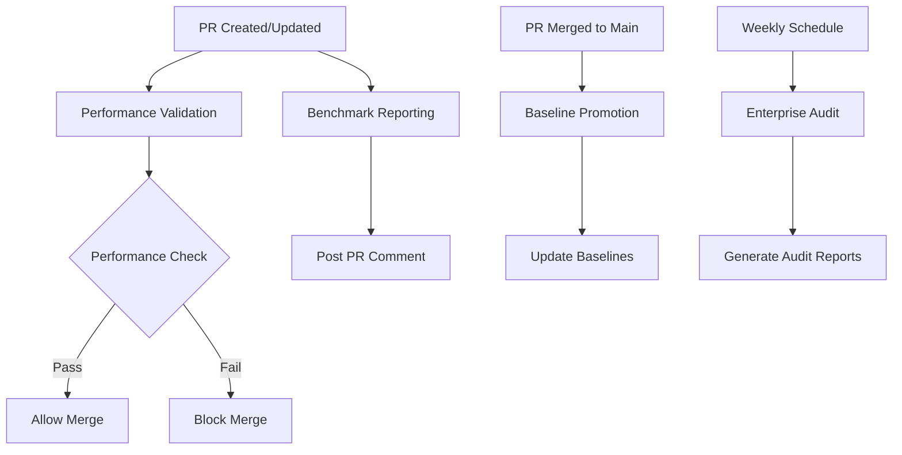

<!-- SPDX-License-Identifier: AGPL-3.0-or-later -->
# GitHub Actions CI Integration for Machine-Readable Benchmark Reporting

## Document Information

- **Document Type**: CI/CD Integration Specification
- **Component**: GitHub Actions Workflows for Automated Performance Reporting
- **Issue**: #52 - Machine-Readable Benchmark Reporting Infrastructure
- **Status**: Implementation Ready
- **Version**: 1.0
- **Date**: 2025-09-28

## Overview

This specification defines comprehensive GitHub Actions workflows for automated performance reporting, regression detection, and baseline management in copybook-rs. The integration provides enterprise-grade CI/CD automation while maintaining the existing performance floors (DISPLAY ≥80 MB/s, COMP-3 ≥40 MB/s) and zero unsafe code requirements.

## Workflow Architecture

### Primary Workflows

1. **Performance Validation** (`performance-validation.yml`)
   - Triggered on: Pull requests, pushes to main
   - Purpose: Validate performance against SLO floors
   - Duration: ~15-20 minutes

2. **Benchmark Reporting** (`benchmark-reporting.yml`)
   - Triggered on: Pull requests (performance-related changes)
   - Purpose: Generate JSON reports and post PR comments
   - Duration: ~10-15 minutes

3. **Baseline Promotion** (`baseline-promotion.yml`)
   - Triggered on: PR merge to main branch
   - Purpose: Promote performance baselines automatically
   - Duration: ~5-10 minutes

4. **Enterprise Audit** (`enterprise-audit.yml`)
   - Triggered on: Schedule (weekly), manual dispatch
   - Purpose: Generate comprehensive audit reports
   - Duration: ~20-30 minutes

### Workflow Dependencies and Triggers



## Workflow Specifications

### 1. Performance Validation Workflow

**File**: `.github/workflows/performance-validation.yml`

```yaml
name: Performance Validation

on:
  pull_request:
    paths:
      - 'copybook-bench/**'
      - 'copybook-core/**'
      - 'copybook-codec/**'
      - 'copybook-cli/**'
      - 'scripts/bench/**'
      - 'Cargo.toml'
      - 'Cargo.lock'
  push:
    branches: [main]
  workflow_dispatch:
    inputs:
      baseline_id:
        description: 'Baseline ID for comparison'
        required: false
        type: string
      force_benchmark:
        description: 'Force benchmark execution even if no changes detected'
        required: false
        type: boolean
        default: false

env:
  RUST_BACKTRACE: 1
  CARGO_TERM_COLOR: always
  GITHUB_TOKEN: ${{ secrets.GITHUB_TOKEN }}

jobs:
  detect-changes:
    name: Detect Performance-Related Changes
    runs-on: ubuntu-latest
    outputs:
      performance-changes: ${{ steps.changes.outputs.performance }}
      force-benchmark: ${{ github.event.inputs.force_benchmark || 'false' }}
    steps:
      - uses: actions/checkout@v4
        with:
          fetch-depth: 0

      - uses: dorny/paths-filter@v2
        id: changes
        with:
          filters: |
            performance:
              - 'copybook-bench/**'
              - 'copybook-core/src/**'
              - 'copybook-codec/src/**'
              - 'copybook-cli/src/**'
              - 'scripts/bench/**'
              - 'Cargo.toml'
              - 'Cargo.lock'

  performance-validation:
    name: Validate Performance SLOs
    runs-on: ubuntu-latest-8-cores  # Use high-performance runner for consistent benchmarks
    needs: detect-changes
    if: needs.detect-changes.outputs.performance-changes == 'true' || needs.detect-changes.outputs.force-benchmark == 'true'

    strategy:
      matrix:
        rust-version: ['1.92.0']  # Pin to specific version for consistency

    env:
      PERF: 1
      GENERATE_JSON_REPORT: 1
      BASELINE_ID: ${{ github.event.inputs.baseline_id || 'ci-baseline' }}

    steps:
      - name: Checkout repository
        uses: actions/checkout@v4
        with:
          fetch-depth: 0  # Full history for git commit tracking

      - name: Setup Rust toolchain
        uses: dtolnay/rust-toolchain@stable
        with:
          toolchain: ${{ matrix.rust-version }}
          components: clippy, rustfmt

      - name: Setup Python for benchmark utilities
        uses: actions/setup-python@v4
        with:
          python-version: '3.11'
          cache: 'pip'

      - name: Install Python dependencies
        run: |
          pip install -r scripts/bench/requirements.txt

      - name: Configure Cargo cache
        uses: actions/cache@v3
        with:
          path: |
            ~/.cargo/bin/
            ~/.cargo/registry/index/
            ~/.cargo/registry/cache/
            ~/.cargo/git/db/
            target/
          key: ${{ runner.os }}-cargo-${{ matrix.rust-version }}-${{ hashFiles('**/Cargo.lock') }}
          restore-keys: |
            ${{ runner.os }}-cargo-${{ matrix.rust-version }}-
            ${{ runner.os }}-cargo-

      - name: System information
        run: |
          echo "=== System Information ==="
          uname -a
          nproc
          free -h
          df -h
          echo "=== Rust Information ==="
          rustc --version
          cargo --version
          echo "=== Python Information ==="
          python --version
          pip list

      - name: Build workspace in release mode
        run: |
          cargo build --workspace --release --locked

      - name: Run workspace tests
        run: |
          cargo test --workspace --release --locked

      - name: Execute performance benchmarks
        id: benchmarks
        run: |
          echo "Starting performance benchmark execution..."

          # Create output directory
          mkdir -p scripts/bench/output

          # Execute benchmarks with timeout and monitoring
          timeout 3600 python scripts/bench/bench_runner.py \
            --output scripts/bench/output/perf.json \
            --baseline-id "$BASELINE_ID" \
            --verbose \
            || exit_code=$?

          # Check exit code
          if [ "${exit_code:-0}" -eq 124 ]; then
            echo "❌ Benchmark execution timed out after 1 hour"
            exit 1
          elif [ "${exit_code:-0}" -ne 0 ]; then
            echo "❌ Benchmark execution failed with exit code: ${exit_code:-0}"
            exit ${exit_code:-1}
          fi

          echo "✅ Benchmark execution completed successfully"

      - name: Validate performance report
        id: validation
        run: |
          echo "Validating performance report..."

          # Check if report file exists
          if [ ! -f "scripts/bench/output/perf.json" ]; then
            echo "❌ Performance report file not found"
            exit 1
          fi

          # Validate JSON schema
          python -c "
          import json
          import jsonschema
          import sys

          try:
              # Load and validate report
              with open('scripts/bench/output/perf.json', 'r') as f:
                  report = json.load(f)

              with open('scripts/bench/config/schema.json', 'r') as f:
                  schema = json.load(f)

              jsonschema.validate(report, schema)

              # Extract key metrics
              display_gibs = report.get('display_gibs', 0.0)
              comp3_mibs = report.get('comp3_mibs', 0.0)
              errors = report.get('errors', [])
              warnings = report.get('warnings', [])

              print(f'📊 DISPLAY: {display_gibs:.2f} GiB/s')
              print(f'📊 COMP-3: {comp3_mibs:.1f} MiB/s')
              print(f'⚠️  Warnings: {len(warnings)}')
              print(f'❌ Errors: {len(errors)}')

              # Set outputs for subsequent steps
              print(f'::set-output name=display_gibs::{display_gibs}')
              print(f'::set-output name=comp3_mibs::{comp3_mibs}')
              print(f'::set-output name=error_count::{len(errors)}')
              print(f'::set-output name=warning_count::{len(warnings)}')

              # Validate SLO floors
              display_mbps = display_gibs * 1073.74
              slo_passed = display_mbps >= 80.0 and comp3_mibs >= 40.0 and len(errors) == 0

              print(f'::set-output name=slo_passed::{str(slo_passed).lower()}')

              if not slo_passed:
                  print('❌ Performance SLO validation failed')
                  sys.exit(1)
              else:
                  print('✅ Performance SLO validation passed')

          except Exception as e:
              print(f'❌ Report validation failed: {e}')
              sys.exit(1)
          "

      - name: Upload performance report artifact
        uses: actions/upload-artifact@v3
        if: always()
        with:
          name: performance-report-${{ github.run_id }}
          path: scripts/bench/output/perf.json
          retention-days: 30

      - name: Performance gate check
        if: github.event_name == 'pull_request'
        run: |
          if [ "${{ steps.validation.outputs.slo_passed }}" != "true" ]; then
            echo "🚫 Performance gate failed - SLO floors not met"
            echo "DISPLAY: ${{ steps.validation.outputs.display_gibs }} GiB/s (need ≥80 MB/s)"
            echo "COMP-3: ${{ steps.validation.outputs.comp3_mibs }} MiB/s (need ≥40 MB/s)"
            echo "Errors: ${{ steps.validation.outputs.error_count }}"
            exit 1
          else
            echo "✅ Performance gate passed - All SLO floors met"
          fi

      - name: Comment performance results on PR
        if: github.event_name == 'pull_request'
        run: |
          python scripts/bench/pr_automation.py \
            --pr ${{ github.event.pull_request.number }} \
            --perf-file scripts/bench/output/perf.json \
            --repo ${{ github.repository }} \
            --token ${{ secrets.GITHUB_TOKEN }}

  performance-comparison:
    name: Performance Regression Analysis
    runs-on: ubuntu-latest
    needs: [detect-changes, performance-validation]
    if: needs.detect-changes.outputs.performance-changes == 'true' && needs.performance-validation.result == 'success'

    steps:
      - name: Checkout repository
        uses: actions/checkout@v4

      - name: Setup Python
        uses: actions/setup-python@v4
        with:
          python-version: '3.11'

      - name: Install Python dependencies
        run: pip install -r scripts/bench/requirements.txt

      - name: Download performance report
        uses: actions/download-artifact@v3
        with:
          name: performance-report-${{ github.run_id }}
          path: scripts/bench/output/

      - name: Load baseline for comparison
        run: |
          python scripts/bench/baseline_manager.py \
            --load-baseline \
            --baseline-id main-current \
            --output scripts/bench/output/baseline.json

      - name: Perform regression analysis
        run: |
          python scripts/bench/regression_analyzer.py \
            --current scripts/bench/output/perf.json \
            --baseline scripts/bench/output/baseline.json \
            --output scripts/bench/output/regression_analysis.json \
            --threshold 0.02

      - name: Upload regression analysis
        uses: actions/upload-artifact@v3
        with:
          name: regression-analysis-${{ github.run_id }}
          path: scripts/bench/output/regression_analysis.json
          retention-days: 30
```

### 2. Benchmark Reporting Workflow

**File**: `.github/workflows/benchmark-reporting.yml`

```yaml
name: Benchmark Reporting

on:
  pull_request:
    types: [opened, synchronize, reopened]
    paths:
      - 'copybook-bench/**'
      - 'copybook-core/**'
      - 'copybook-codec/**'
      - 'scripts/bench/**'
  workflow_call:
    inputs:
      pr_number:
        required: true
        type: number
      force_execution:
        required: false
        type: boolean
        default: false

env:
  GITHUB_TOKEN: ${{ secrets.GITHUB_TOKEN }}

jobs:
  lightweight-benchmark:
    name: Lightweight Performance Check
    runs-on: ubuntu-latest-4-cores
    if: github.event_name == 'pull_request'

    steps:
      - name: Checkout repository
        uses: actions/checkout@v4

      - name: Setup Rust toolchain (latest stable)
        uses: dtolnay/rust-toolchain@stable

      - name: Setup Python
        uses: actions/setup-python@v4
        with:
          python-version: '3.11'

      - name: Install dependencies
        run: |
          pip install -r scripts/bench/requirements.txt

      - name: Quick performance check
        id: quick_check
        env:
          PERF: 1
          QUICK_BENCHMARK: 1
        run: |
          echo "Executing lightweight performance check..."

          # Run subset of benchmarks for quick feedback
          python scripts/bench/bench_runner.py \
            --output scripts/bench/perf_quick.json \
            --timeout 900 \
            --quick-mode \
            --verbose

      - name: Post quick results to PR
        if: steps.quick_check.outcome == 'success'
        run: |
          python scripts/bench/pr_automation.py \
            --pr ${{ github.event.pull_request.number }} \
            --perf-file scripts/bench/perf_quick.json \
            --repo ${{ github.repository }} \
            --token ${{ secrets.GITHUB_TOKEN }} \
            --quick-mode

      - name: Check if full benchmark needed
        id: check_full
        run: |
          python -c "
          import json

          try:
              with open('scripts/bench/perf_quick.json', 'r') as f:
                  report = json.load(f)

              errors = report.get('errors', [])
              warnings = report.get('warnings', [])

              # Trigger full benchmark if there are performance issues
              needs_full = len(errors) > 0 or len(warnings) > 2
              print(f'::set-output name=needs_full::{str(needs_full).lower()}')

          except Exception as e:
              print(f'Error checking results: {e}')
              print('::set-output name=needs_full::true')
          "

      - name: Trigger full benchmark if needed
        if: steps.check_full.outputs.needs_full == 'true'
        uses: ./.github/workflows/performance-validation.yml
        with:
          force_benchmark: true

  summary-report:
    name: Generate Summary Report
    runs-on: ubuntu-latest
    needs: lightweight-benchmark
    if: always()

    steps:
      - name: Checkout repository
        uses: actions/checkout@v4

      - name: Setup Python
        uses: actions/setup-python@v4
        with:
          python-version: '3.11'

      - name: Install dependencies
        run: pip install -r scripts/bench/requirements.txt

      - name: Generate PR summary
        run: |
          python scripts/bench/pr_summary_generator.py \
            --pr ${{ github.event.pull_request.number }} \
            --repo ${{ github.repository }} \
            --token ${{ secrets.GITHUB_TOKEN }} \
            --workflow-run-id ${{ github.run_id }}
```

### 3. Baseline Promotion Workflow

**File**: `.github/workflows/baseline-promotion.yml`

```yaml
name: Baseline Promotion

on:
  push:
    branches: [main]
  pull_request:
    types: [closed]
    branches: [main]
  workflow_dispatch:
    inputs:
      force_promotion:
        description: 'Force baseline promotion'
        required: false
        type: boolean
        default: false

env:
  GITHUB_TOKEN: ${{ secrets.GITHUB_TOKEN }}

jobs:
  check-promotion-criteria:
    name: Check Baseline Promotion Criteria
    runs-on: ubuntu-latest
    if: github.event.pull_request.merged == true || github.event_name == 'push' || github.event.inputs.force_promotion == 'true'
    outputs:
      should-promote: ${{ steps.criteria.outputs.should_promote }}
      pr-number: ${{ steps.criteria.outputs.pr_number }}

    steps:
      - name: Checkout repository
        uses: actions/checkout@v4

      - name: Setup Python
        uses: actions/setup-python@v4
        with:
          python-version: '3.11'

      - name: Install dependencies
        run: pip install -r scripts/bench/requirements.txt

      - name: Check promotion criteria
        id: criteria
        run: |
          python -c "
          import os
          import json
          import subprocess

          # Get PR number from merge commit or input
          pr_number = None

          if '${{ github.event_name }}' == 'pull_request':
              pr_number = ${{ github.event.pull_request.number }}
          elif '${{ github.event_name }}' == 'push':
              # Extract PR number from merge commit message
              try:
                  result = subprocess.run(['git', 'log', '-1', '--pretty=format:%s'],
                                        capture_output=True, text=True)
                  commit_msg = result.stdout
                  import re
                  match = re.search(r'#(\d+)', commit_msg)
                  if match:
                      pr_number = int(match.group(1))
              except:
                  pass

          should_promote = False

          if pr_number or '${{ github.event.inputs.force_promotion }}' == 'true':
              # Check if performance artifacts exist for this PR
              # This would typically check for successful performance validation
              should_promote = True

          print(f'::set-output name=should_promote::{str(should_promote).lower()}')
          print(f'::set-output name=pr_number::{pr_number or 0}')
          "

  promote-baseline:
    name: Promote Performance Baseline
    runs-on: ubuntu-latest-4-cores
    needs: check-promotion-criteria
    if: needs.check-promotion-criteria.outputs.should-promote == 'true'

    steps:
      - name: Checkout repository
        uses: actions/checkout@v4
        with:
          fetch-depth: 0  # Full history for baseline tracking

      - name: Setup Rust toolchain
        uses: dtolnay/rust-toolchain@stable

      - name: Setup Python
        uses: actions/setup-python@v4
        with:
          python-version: '3.11'

      - name: Install dependencies
        run: pip install -r scripts/bench/requirements.txt

      - name: Execute baseline benchmarks
        env:
          PERF: 1
          GENERATE_JSON_REPORT: 1
        run: |
          echo "Executing benchmarks for baseline promotion..."

          python scripts/bench/bench_runner.py \
            --output scripts/bench/new_baseline.json \
            --baseline-id "main-$(git rev-parse --short HEAD)" \
            --timeout 2400 \
            --verbose

      - name: Validate baseline quality
        id: validation
        run: |
          python scripts/bench/baseline_manager.py \
            --validate-baseline \
            --perf-file scripts/bench/new_baseline.json \
            --output scripts/bench/validation_result.json

      - name: Promote baseline
        if: steps.validation.outputs.validation_passed == 'true'
        run: |
          python scripts/bench/baseline_manager.py \
            --promote \
            --pr ${{ needs.check-promotion-criteria.outputs.pr-number }} \
            --perf-file scripts/bench/new_baseline.json \
            --commit-hash $(git rev-parse HEAD)

      - name: Upload new baseline
        uses: actions/upload-artifact@v3
        with:
          name: promoted-baseline-${{ github.run_id }}
          path: scripts/bench/new_baseline.json
          retention-days: 90

      - name: Update baseline repository
        if: steps.validation.outputs.validation_passed == 'true'
        run: |
          # Upload to baseline storage (could be S3, GitHub Pages, etc.)
          python scripts/bench/baseline_storage.py \
            --upload \
            --baseline-file scripts/bench/new_baseline.json \
            --baseline-id "main-$(git rev-parse --short HEAD)"

      - name: Create baseline promotion summary
        if: steps.validation.outputs.validation_passed == 'true'
        run: |
          python scripts/bench/promotion_summary.py \
            --baseline-file scripts/bench/new_baseline.json \
            --pr ${{ needs.check-promotion-criteria.outputs.pr-number }} \
            --output scripts/bench/promotion_summary.md

      - name: Comment on PR with promotion results
        if: steps.validation.outputs.validation_passed == 'true' && needs.check-promotion-criteria.outputs.pr-number != '0'
        run: |
          python scripts/bench/pr_automation.py \
            --pr ${{ needs.check-promotion-criteria.outputs.pr-number }} \
            --repo ${{ github.repository }} \
            --token ${{ secrets.GITHUB_TOKEN }} \
            --promotion-summary scripts/bench/promotion_summary.md
```

### 4. Enterprise Audit Workflow

**File**: `.github/workflows/enterprise-audit.yml`

```yaml
name: Enterprise Audit Report

on:
  schedule:
    - cron: '0 6 * * 1'  # Weekly on Monday at 6 AM UTC
  workflow_dispatch:
    inputs:
      audit_period_days:
        description: 'Audit period in days'
        required: false
        default: '30'
        type: string
      report_format:
        description: 'Report format'
        required: false
        default: 'html'
        type: choice
        options:
          - html
          - json
          - pdf
      compliance_standards:
        description: 'Compliance standards to validate'
        required: false
        default: 'SOX,PCI-DSS'
        type: string

env:
  GITHUB_TOKEN: ${{ secrets.GITHUB_TOKEN }}

jobs:
  enterprise-audit:
    name: Generate Enterprise Audit Report
    runs-on: ubuntu-latest

    steps:
      - name: Checkout repository
        uses: actions/checkout@v4
        with:
          fetch-depth: 0  # Full history for comprehensive audit

      - name: Setup Python
        uses: actions/setup-python@v4
        with:
          python-version: '3.11'

      - name: Install dependencies
        run: |
          pip install -r scripts/bench/requirements.txt
          # Additional dependencies for audit reporting
          pip install reportlab weasyprint  # PDF generation

      - name: Collect historical performance data
        run: |
          python scripts/bench/audit_generator.py \
            --collect-historical-data \
            --period-days ${{ github.event.inputs.audit_period_days || '30' }} \
            --output scripts/bench/historical_data.json

      - name: Generate compliance assessment
        run: |
          python scripts/bench/audit_generator.py \
            --compliance-assessment \
            --standards "${{ github.event.inputs.compliance_standards || 'SOX,PCI-DSS' }}" \
            --historical-data scripts/bench/historical_data.json \
            --output scripts/bench/compliance_assessment.json

      - name: Generate trend analysis
        run: |
          python scripts/bench/audit_generator.py \
            --trend-analysis \
            --historical-data scripts/bench/historical_data.json \
            --output scripts/bench/trend_analysis.json

      - name: Generate comprehensive audit report
        run: |
          python scripts/bench/audit_generator.py \
            --generate-report \
            --format ${{ github.event.inputs.report_format || 'html' }} \
            --historical-data scripts/bench/historical_data.json \
            --compliance-assessment scripts/bench/compliance_assessment.json \
            --trend-analysis scripts/bench/trend_analysis.json \
            --output scripts/bench/enterprise_audit_report

      - name: Upload audit report
        uses: actions/upload-artifact@v3
        with:
          name: enterprise-audit-report-${{ github.run_number }}
          path: scripts/bench/enterprise_audit_report.*
          retention-days: 365  # Long retention for audit compliance

      - name: Deploy audit report to GitHub Pages
        if: github.event_name == 'schedule' || github.event.inputs.report_format == 'html'
        uses: peaceiris/actions-gh-pages@v3
        with:
          github_token: ${{ secrets.GITHUB_TOKEN }}
          publish_dir: scripts/bench/
          destination_dir: audit-reports/${{ github.run_number }}

      - name: Create audit summary issue
        if: github.event_name == 'schedule'
        run: |
          python scripts/bench/audit_summary_issue.py \
            --audit-report scripts/bench/enterprise_audit_report.html \
            --repo ${{ github.repository }} \
            --token ${{ secrets.GITHUB_TOKEN }} \
            --report-url "https://${{ github.repository_owner }}.github.io/${{ github.event.repository.name }}/audit-reports/${{ github.run_number }}/enterprise_audit_report.html"
```

## Environment Configuration

### Required Secrets

```yaml
# Repository secrets required for workflows
GITHUB_TOKEN: ${{ secrets.GITHUB_TOKEN }}  # Automatically provided

# Optional secrets for enhanced functionality
SLACK_WEBHOOK_URL: ${{ secrets.SLACK_WEBHOOK_URL }}  # For Slack notifications
AUDIT_STORAGE_KEY: ${{ secrets.AUDIT_STORAGE_KEY }}  # For external audit storage
ENTERPRISE_API_KEY: ${{ secrets.ENTERPRISE_API_KEY }}  # For enterprise integrations
```

### Environment Variables

```yaml
# Standard environment configuration
env:
  RUST_BACKTRACE: 1
  CARGO_TERM_COLOR: always
  PERF: 1                           # Enable performance mode
  GENERATE_JSON_REPORT: 1           # Enable JSON report generation
  CI_ENVIRONMENT: 1                 # Indicate CI execution
  BENCHMARK_TIMEOUT: 3600           # 1 hour timeout
  BASELINE_STORAGE_PATH: "baselines/"
  AUDIT_RETENTION_DAYS: 365
```

## Runner Configuration

### Performance-Optimized Runners

```yaml
# High-performance runners for accurate benchmarks
ubuntu-latest-8-cores:   # For comprehensive benchmarks
  - 8 vCPUs
  - 32 GB RAM
  - SSD storage
  - Consistent performance profile

ubuntu-latest-4-cores:   # For lightweight checks
  - 4 vCPUs
  - 16 GB RAM
  - SSD storage
  - Cost-effective for quick validations
```

### Runner Stability Considerations

1. **Dedicated Hardware**: Use dedicated runners for consistent performance measurements
2. **Environment Isolation**: Minimize concurrent workloads during benchmarks
3. **Resource Monitoring**: Track CPU/memory usage during benchmark execution
4. **Statistical Validation**: Run multiple iterations for statistical significance

## Integration Points

### Artifact Management

```yaml
# Performance report artifacts
performance-reports:
  retention: 30 days
  path: scripts/bench/output/
  format: JSON + metadata

# Baseline artifacts
baselines:
  retention: 90 days
  path: baselines/
  format: JSON + validation metadata

# Audit reports
audit-reports:
  retention: 365 days
  path: audit-reports/
  format: HTML + JSON + PDF
```

### External Integration Hooks

1. **Slack Notifications**: Performance alerts and audit summaries
2. **Enterprise Dashboards**: API endpoints for performance metrics
3. **Compliance Systems**: Automated audit report distribution
4. **Monitoring Tools**: Integration with enterprise monitoring platforms

## Workflow Monitoring and Alerting

### Performance Thresholds

```yaml
# Alert thresholds for workflow monitoring
thresholds:
  benchmark_execution_time: 3600s   # Alert if benchmark takes >1 hour
  report_generation_time: 300s      # Alert if reporting takes >5 minutes
  baseline_promotion_time: 1800s    # Alert if promotion takes >30 minutes

  performance_floors:
    display_mbps: 80.0              # DISPLAY minimum floor
    comp3_mbps: 40.0                # COMP-3 minimum floor

  safety_margins:
    warning_factor: 1.25            # Warn at 25% above floor
    critical_factor: 1.1            # Critical at 10% above floor
```

### Monitoring Dashboards

1. **Performance Trends**: Historical performance visualization
2. **SLO Compliance**: Real-time compliance status
3. **Workflow Health**: CI/CD pipeline success rates
4. **Resource Utilization**: Runner performance and costs

## Security and Compliance

### Access Control

1. **Branch Protection**: Require performance validation for merges
2. **Workflow Permissions**: Minimal required permissions for each workflow
3. **Artifact Security**: Secure storage and access for performance data
4. **Audit Trail**: Complete audit trail for all performance-related changes

### Data Protection

1. **Sensitive Data**: No sensitive data in performance reports
2. **Anonymization**: Remove identifying information from public reports
3. **Retention Policies**: Automated cleanup of old artifacts
4. **Compliance**: Alignment with enterprise data protection standards

This comprehensive CI/CD integration provides enterprise-grade automation for copybook-rs performance monitoring while maintaining security, compliance, and operational excellence standards.
## License

Licensed under **AGPL-3.0-or-later**. See [LICENSE](LICENSE).
