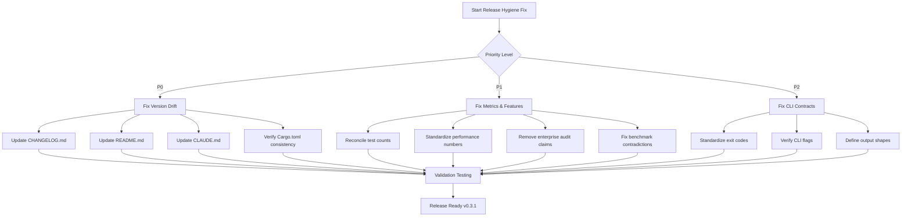

# copybook-rs Release Hygiene Fix Plan

## Executive Summary

This plan addresses 5 major release hygiene issues identified in copybook-rs to create a coherent v0.3.1 release state where documentation and reality align perfectly.

**Decision Framework**: Stay at v0.3.1 and remove over-claimed enterprise audit features until fully implemented.

## Issue 1: Version + Status Drift (One Repo, Three Truths)

### Problem
- `Cargo.toml`: v0.3.1 (actual codebase)
- `CHANGELOG.md`: Claims v0.4.0 released on 2025-12-02 (future date)
- `README.md`: Shows v0.3.1 but describes v0.4.0 features
- `CLAUDE.md`: Shows "v0.4.0 maintenance"

### Recommended Approach: Stay at v0.3.1
**Rationale**: The actual codebase is v0.3.1 with no breaking changes that warrant v0.4.0. Future date confirms this is documentation error.

### Specific Changes Required

#### P0 Changes
1. **Fix CHANGELOG.md**:
   - Remove entire v0.4.0 entry (lines 8-62)
   - Create proper v0.3.1 entry with actual release date (2025-09-23)
   - Move v0.4.0 features to "Planned for v0.4.0" section

2. **Update README.md**:
   - Change "Current Status: Engineering Preview (v0.3.1)" to remove v0.4.0 references
   - Update feature descriptions to reflect actual v0.3.1 capabilities
   - Remove references to v0.4.0 features not yet implemented

3. **Update CLAUDE.md**:
   - Change line 9 from "v0.4.0 maintenance" to "v0.3.1 maintenance"
   - Update line 496 from "v0.4.0 maintenance" to "v0.3.1 maintenance"

4. **Verify workspace consistency**:
   - Confirm all `Cargo.toml` files use `version.workspace = true`
   - Ensure no hardcoded version overrides exist

## Issue 2: Metrics Drift (Test Counts + Performance Numbers)

### Problem
- README.md: Claims "615/615 tests passing (54 skipped)"
- CLAUDE.md: Claims "704 tests passing (58 skipped)"
- Performance numbers vary between documents (205 MiB/s vs 169 MiB/s vs 49 MiB/s)

### Recommended Approach: Establish Single Source of Truth
**Rationale**: Run actual test suite and use PERFORMANCE_VALIDATION_FINAL.md as canonical performance source.

### Specific Changes Required

#### P1 Changes
1. **Reconcile test counts**:
   - Run `cargo nextest --workspace` to get actual count
   - Update both README.md and CLAUDE.md with consistent numbers
   - Ensure skipped tests count matches reality

2. **Standardize performance reporting**:
   - Use PERFORMANCE_VALIDATION_FINAL.md values (169.19 MiB/s DISPLAY, 49.48 MiB/s COMP-3)
   - Update README.md and CLAUDE.md to match these exact numbers
   - Remove conflicting performance claims from other documentation

3. **Update PERFORMANCE_VALIDATION_FINAL.md**:
   - Verify timestamp is current
   - Ensure methodology matches scripts/bench.sh output

## Issue 3: Over-claiming Enterprise Audit/Compliance Features

### Problem
- README.md has extensive enterprise audit sections (lines 587-758)
- CLI includes audit command scaffolding
- Test files contain extensive audit scaffolding
- Actual implementation appears incomplete/stubbed

### Recommended Approach: Remove Until Implemented
**Rationale**: Documentation claims capabilities that don't exist, creating user confusion.

### Specific Changes Required

#### P1 Changes
1. **Remove enterprise audit sections from README.md**:
   - Remove lines 587-758 (entire enterprise audit section)
   - Remove related CLI examples and API documentation
   - Update feature matrix to remove audit capabilities

2. **Remove or stub enterprise audit test files**:
   - Remove `copybook-cli/tests/audit_cli_comprehensive.rs`
   - Remove `copybook-core/tests/enterprise_audit_minimal.rs`
   - Remove `copybook-bench/tests/audit_performance_simple.rs`
   - Remove `tests/issue_52_enterprise_audit_compliance.rs`
   - Remove audit-related fixtures in `fixtures/enterprise/audit/`

3. **Update ROADMAP.md**:
   - Remove enterprise audit references from current status
   - Move audit features to "Future Considerations" section
   - Update telemetry section to reflect actual capabilities

4. **Stub audit implementation**:
   - Keep audit feature flag but return "not implemented" errors
   - Remove complex audit scaffolding from CLI
   - Simplify audit.rs to basic placeholder

## Issue 4: Internal Contradictions Around Benchmark Automation

### Problem
- Documentation claims benchmark automation is "available" but Issue #52 utilities haven't shipped
- Scripts exist but integration incomplete
- Contradictory claims about CI integration status

### Recommended Approach: Align Documentation with Reality
**Rationale**: Be honest about current state to set proper user expectations.

### Specific Changes Required

#### P1 Changes
1. **Resolve benchmark automation contradictions**:
   - Update README.md to clarify current benchmark tooling status
   - Document what's actually implemented vs planned
   - Remove claims about PR automation until available

2. **Standardize benchmark reporting methodology**:
   - Ensure scripts/bench.sh methodology matches documentation
   - Clarify SLO validation approach
   - Document manual vs automated aspects clearly

## Issue 5: CLI Contract Ambiguity

### Problem
- Exit codes documented in README.md table but implementation may differ
- CLI flag documentation inconsistent across files
- Output shapes not formally specified

### Recommended Approach: Formalize CLI Contracts
**Rationale**: Create predictable, well-documented CLI behavior.

### Specific Changes Required

#### P2 Changes
1. **Standardize CLI exit code documentation**:
   - Verify README.md exit code table matches `exit_codes.rs` implementation
   - Ensure all documented exit codes are actually returned
   - Add missing exit codes to documentation if needed

2. **Verify CLI flag consistency**:
   - Audit all CLI flags in README.md examples
   - Cross-reference with actual CLI implementation
   - Fix any discrepancies in flag names or behavior

3. **Define canonical CLI output shapes**:
   - Document JSON schema for each command output
   - Specify exact format for error messages
   - Create examples of canonical output for each command

## Implementation Priority Matrix

| Priority | Issue | Files Affected | Dependencies |
|----------|--------|----------------|--------------|
| P0 | Version drift | CHANGELOG.md, README.md, CLAUDE.md, all Cargo.toml files | None |
| P1 | Metrics drift | README.md, CLAUDE.md, PERFORMANCE_VALIDATION_FINAL.md | Test run |
| P1 | Enterprise audit over-claim | README.md, ROADMAP.md, multiple test files | Code audit |
| P1 | Benchmark contradictions | README.md, scripts/bench.sh | Script testing |
| P2 | CLI contract ambiguity | README.md, copybook-cli/src/*.rs | CLI testing |

## Validation Checklist

After completing all changes:

1. **Version consistency**: All files reference v0.3.1 with correct dates
2. **Metrics alignment**: Test counts match, performance numbers consistent
3. **Feature honesty**: Only documented features are actually implemented
4. **Benchmark clarity**: Automation status accurately reflected
5. **CLI predictability**: Exit codes, flags, and outputs match documentation

## Mermaid Workflow

## Success Criteria

1. All version references consistent across workspace
2. Test counts match actual `cargo nextest` output
3. Performance numbers use single source of truth
4. Only implemented features documented
5. CLI behavior matches documentation exactly
6. No future dates in any documentation
7. CHANGELOG reflects actual release history

This plan creates a release-ready state where users can trust that documentation accurately reflects the actual capabilities and version of copybook-rs.